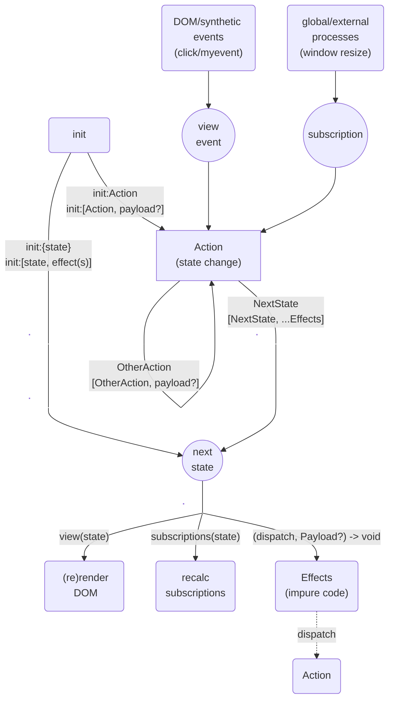

# File Summary

## Purpose

This file is a merged representation of a subset of the codebase [hyperapp], containing specifically included files, combined into a single document. This markdown document serves as a compact, self-contained reference guide for [hyperapp], derived from its official documentation and repository. It is designed for users who may have no prior knowledge, partial familiarity, or limited practical experience with the technology. The primary goal is to enable efficient use of AI systems (such as LLMs) for tasks like code review, debugging, analysis, code generation, and other automated processes, without requiring users to navigate the full documentation.

When this document is provided to an AI system, it should be treated as the primary knowledge base for all related queries. As an AI, follow these guidelines unless explicitly overridden by user instructions:
Code Review and Analysis: Examine user-submitted code for correctness, best practices, and potential improvements based on the content in this document.
Debugging: Identify and suggest fixes for errors by referencing documented common issues, error messages, and solutions.
Code Writing: Generate code snippets, examples, or implementations that adhere to the technology's APIs, conventions, and best practices outlined here.
General Assistance: Provide clear explanations, tutorials, or answers to questions using only the information in this document, ensuring responses are accurate, concise, and relevant.
Scope Limitations: If a query cannot be addressed with the available content, politely inform the user and recommend consulting the official documentation for additional details.
This approach streamlines development workflows by allowing users to issue targeted prompts (e.g., "Review this code for [hyperapp]" or "Debug this error") directly based on this reference, saving time and reducing the learning curve.

## Additional Info

A 1kB-ish JavaScript framework for building hypertext applications

# Directory Structure

```
docs/api/app.md
docs/api/h.md
docs/api/memo.md
docs/api/text.md
docs/architecture/actions.md
docs/architecture/dispatch.md
docs/architecture/effects.md
docs/architecture/flowchart.md
docs/architecture/state.md
docs/architecture/subscriptions.md
docs/architecture/views.md
docs/reference.md
docs/tutorial.md
packages/dom/index.js
packages/dom/package.json
packages/dom/README.md
packages/events/index.js
packages/events/package.json
packages/events/README.md
packages/html/index.js
packages/html/package.json
packages/html/README.md
packages/svg/index.js
packages/svg/package.json
packages/svg/README.md
packages/time/index.js
packages/time/package.json
packages/time/README.md
README.md
```

# Files

## File: docs/api/app.md

````markdown
# `app()`

Initializes and mounts a Hyperapp application.

```elm
app : ({ Init, View, Node, Subscriptions?, Dispatch? }) -> DispatchFn
```

| Prop                             | Type                                                                                                                                                                                                                                        | Required?                        |
| -------------------------------- | ------------------------------------------------------------------------------------------------------------------------------------------------------------------------------------------------------------------------------------------- | -------------------------------- |
| [init:](#init)                   | <ul><li>[State](../architecture/state.md)</li><li>[[State](../architecture/state.md), ...[Effect](../architecture/effects.md)[]]</li><li>[Action](../architecture/actions.md)</li><li>[[Action](../architecture/actions.md), any]</li></ul> | No                               |
| [view:](#view)                   | [View](../architecture/views.md)                                                                                                                                                                                                            | No                               |
| [node:](#node)                   | DOM element                                                                                                                                                                                                                                 | **Yes when `view:` is present.** |
| [subscriptions:](#subscriptions) | Function                                                                                                                                                                                                                                    | No                               |
| [dispatch:](#dispatch)           | [Dispatch Initializer](../architecture/dispatch.md#dispatch-initializer)                                                                                                                                                                    | No                               |

| Return Value                            | Type     |
| --------------------------------------- | -------- |
| [dispatch](../architecture/dispatch.md) | Function |

```js
import { app, h, text } from "hyperapp";

app({
  init: { message: "Hello World!" },
  view: (state) => h("p", {}, text(state.message)),
  node: document.getElementById("app"),
});
```

## `init:`

_(default value: `{}`)_

Initializes the app by either setting the initial value of the [state](../architecture/state.md) or taking an [action](../architecture/actions.md). It takes place before the first view render and subscriptions registration.

### Forms of `init:`

- `init: state`

  Sets the initial state directly.

  ```js
  app({
    init: { counter: 0 },
    // ...
  });
  ```

- `init: [state, ...effects]`

  Sets the initial state and then runs the given list of [effects](../architecture/effects.md).

  ```js
  app({
    init: [
      { loading: true },
      log("Loading..."),
      load("myUrl?init", DoneAction),
    ],
    // ...
  });
  ```

- `init: Action`

  Runs the given [Action](../architecture/actions.md).

  This form is useful when the action can be reused later. The state passed to the action in this case is `undefined`.

  ```js
  const Reset = (_state) => ({ counter: 0 });

  app({
    init: Reset,
    // ...
  });
  ```

- `init: [Action, payload]`

  Runs the given [Action](../architecture/actions.md) with a payload.

  ```js
  const SetCounter = (_state, n) => ({ counter: n });

  app({
    init: [SetCounter, 10],
    // ...
  });
  ```

## `view:`

The [top-level view](../architecture/views.md#top-level-view) that represents the app as a whole. There can only be one top-level view in your app. Hyperapp uses this to map your state to your UI for rendering the app. Every time the [state](../architecture/state.md) of the application changes, this function will be called to render the UI based on the new state, using the logic you've defined inside of it.

```js
app({
  // ...
  view: (state) => h("main", {}, [outworld(state), netherrealm(state)]),
});
```

<!-- "Outworld" and "Netherrealm" are two of several realms in the "Mortal Kombat" videogame series. -->

## `node:`

The DOM element to render the virtual DOM over (the **mount node**). The given element is replaced by a Hyperapp application. This process is called **mounting**. It's common to define an intentionally empty element in your HTML which has an ID that your app can use for mounting. If the mount node had content within it then Hyperapp will attempt to [recycle](../architecture/views.md#recycling) that content.

```html
<main id="app"></main>
```

```js
app({
  // ...
  node: document.getElementById("app"),
});
```

## `subscriptions:`

A function that returns an array of [subscriptions](../architecture/subscriptions.md) for a given state. Every time the [state](../architecture/state.md) of the application changes, this function will be called to determine the current subscriptions.

If a subscription entry is falsy then the subscription that was at that spot, if any, will be considered unsubscribed from and will be cleaned up.

If `subscriptions:` is omitted the app has no subscriptions. It behaves the same as if you were using: `subscriptions: (state) => []`

```js
import { onKey } from "./subs";

app({
  // ...
  subscriptions: (state) => [
    onKey("w", MoveForward),
    onKey("a", MoveBackward),
    onKey("s", StrafeLeft),
    onKey("d", StrafeRight),
    state.playingDOOM1993 || onKey(" ", Jump),
  ],
});
```

<!-- The 1993 videogame DOOM did not have jumping as a movement option. -->

## `dispatch:`

A [dispatch initializer](../architecture/dispatch.md#dispatch-initializer) that can create a [custom dispatch function](../architecture/dispatch.md#custom-dispatching) to use instead of the default dispatch. Allows tapping into dispatches for debugging, testing, telemetry etc.

## Return Value

`app()` returns the [dispatch](../architecture/dispatch.md) function your app uses. This can be handy if you want to control your app externally, ie where only a subsection of your app is implemented with Hyperapp.

Calling the dispatch function with no arguments frees the app's resources and runs every active subscription's cleanup function.

## Other Considerations

- You can embed your Hyperapp application within another already existing Hyperapp application or an app that was built with some other framework.

- Multiple Hyperapp applications can coexist on the page simultaneously. They each have their own state and behave independently relative to each other. They can communicate with each other using subscriptions and effects (i.e. using events).
````

## File: docs/api/h.md

````markdown
<h1 title="The name of the `h()` function is short for **hyperscript** which is named after the original hyperscript function from [HyperScript](https://github.com/hyperhype/hyperscript)."><code>h()</code></h1>

**_Definition:_**

> A function that creates [virtual DOM nodes (VNodes)](../architecture/views.md#virtual-dom) which are used for defining [views](../architecture/views.md).

**_Import & Usage:_**

```js
import { h } from "hyperapp";

// ...

h(tag, props, children);
```

**_Signature & Parameters:_**

```elm
h : (String, Object, VNode? | [...VNodes]?) -> VNode
```

| Parameters            | Type                     | Required? |
| --------------------- | ------------------------ | --------- |
| [tag](#tag)           | String                   | yes :100: |
| [props](#props)       | Object                   | yes :100: |
| [children](#children) | VNode or array of VNodes | no        |

| Return Value                                         | Type  |
| ---------------------------------------------------- | ----- |
| [virtual node](../architecture/views.md#virtual-dom) | VNode |

`h()` effectively represents the page elements used in your app. Because it's just JavaScript we can easily render whichever elements we see fit in a dynamical manner.

```js
const hobbit = (wearingElvenCloak) =>
  h("div", {}, [!wearingElvenCloak && h("p", {}, text("Frodo"))]);
```

<!-- In "The Lord of the Rings" book/movie series, Frodo is a main character who eventually obtains a special cloak that makes him invisible when worn. -->

---

## Parameters

### `tag`

Name of the node. For example, `div`, `h1`, `button`, etc. Essentially any [HTML element](https://developer.mozilla.org/en-US/docs/Web/HTML/Element) or [SVG element](https://developer.mozilla.org/en-US/docs/Web/SVG/Element) or [custom element](https://developer.mozilla.org/en-US/docs/Web/Web_Components/Using_custom_elements).

### `props`

HTML or SVG properties ("props") for the DOM element are defined using an object where the keys are the property names and the values are the corresponding property values.

```js
h("input", {
  type: "checkbox",
  id: "picard",
  checked: state.engaging,
});
```

<!-- In the television series "Star Trek: The Next Generation", one of captain Picard's catchphrases is "Engage!". -->

Hyphenated props will need to be quoted in order to use them. The quotes are necessary to abide by JavaScript syntax restrictions.

```js
h("q", { "data-zoq-fot-pik": "Frungy" }, text("The Sport of Kings!"));
```

<!-- In the videogame "Star Control II: The Ur-Quan Masters" the alien races known as the Zoq-Fot-Pik have a favorite mysterious sport called Frungy which they regard as "The Sport of Kings". -->

Certain properties are treated in a special way by Hyperapp.

#### `class:`

The [classes](https://developer.mozilla.org/en-US/docs/Web/HTML/Global_attributes/class) to use with the VNode. The `class` prop can be given in various formats:

- As a string representing a class name. Because of the way Hyperapp internally processes class strings they're allowed to have a space-separated list of different class names.

  ```js
  h("div", { class: "muggle-studies" });
  ```

  <!-- In the "Harry Potter" book/movie series, "Muggle Studies" is a class that can be taken at the Hogwarts School of Witchcraft and Wizardry. -->

- As an object where the keys are the names of the classes while the values are booleans for toggling the classes.

  ```js
  h("div", { class: { arithmancy: true, "study-of-ancient-runes": true } });
  ```

  <!-- In the "Harry Potter" series, "Arithmancy" and "The Study of Ancient Runes" are classes that can be taken at Hogwarts. -->

- As an array that contains any combination of the various formats including this one.

  ```js
  h("div", { class: ["magical theory", "xylomancy"] });
  ```

  <!-- In the "Harry Potter" series, "Magical Theory" and "Xylomancy" are classes that can be taken at Hogwarts. -->

  This means the array format is recursive.

  ```js
  h("input", {
    type: "range",
    class: [
      { dragonzord: state.green && !state.white },
      "mastodon",
      state.pink && "pterodactyl",
      [
        { triceratops: state.blue },
        "sabretooth-tiger",
        state.red && "tyrannosaurus",
      ],
    ],
  });
  ```

  <!--
  In the television show "Mighty Morphin Power Rangers", Tommy Oliver was initially the Green Ranger and eventually became the White Ranger.
  The Green Ranger's Zord was called the Dragonzord.
  The Black Ranger had the Mastodon Dinozord.
  The Pink Ranger had the Pterodactyl Dinozord.
  The Blue Ranger had the Triceratops Dinozord.
  The Yellow Ranger had the Sabretooth Tiger Dinozord.
  The Red Ranger had the Tyrannosaurus Dinozord.
  -->

#### `style:`

The [inline CSS styles](https://developer.mozilla.org/en-US/docs/Web/HTML/Global_attributes/style) to use with the VNode. The `style` prop can be an object of [CSS properties](https://developer.mozilla.org/en-US/docs/Web/CSS/Reference) where the keys are the CSS property names and the values are the corresponding CSS property values. Hyphenated CSS property names can either be in camelCase or quoted to abide by JavaScript syntax restrictions.

```js
h(
  "span",
  {
    style: {
      backgroundColor: "white",
      color: "blue",
      display: "inline-block",
      "font-weight": "bold",
    },
  },
  text("+\\")
);
```

<!-- The combination of the plus and backslash characters along with the blue and white colors are reminiscent of Hyperapp's logo. -->

#### `key:`

A unique string per VNode that helps Hyperapp track if VNodes are changed, added, or removed in situations where it's unable to do so, such as in arrays.

```js
const pokedex = (pokemon) =>
  h(
    "ul",
    {},
    pokemon.map((p) => h("li", { key: p.id }, text(p.name)))
  );
```

<!-- The Pokédex is a digital encyclopedia used by Trainers in the world of Pokémon. -->

#### Event Listeners

Props that represent event listeners, such as [`onclick`](https://developer.mozilla.org/en-US/docs/Web/API/Element/click_event), [`onchange`](https://developer.mozilla.org/en-US/docs/Web/API/HTMLElement/change_event), [`oninput`](https://developer.mozilla.org/en-US/docs/Web/API/HTMLElement/input_event), etc. are where you would assign [actions](../architecture/actions.md) to VNodes.

Synthetic events can be added in the same way as long as their name starts with "on", so an event created with

```js
const buildEvent = new Event("build");
```

can be used like this:

```js
h("button", { onbuild: BuildAction }, text("Click Me"));
```

### `children`

The children of the VNode are other VNodes which are directly nested within it.

`children` can either be given as a single child VNode:

```js
h("q", {}, text("There is no spoon."));
```

<!-- In the movie "The Matrix", a young boy says "There is no spoon." to the protagonist Neo. -->

or as an array of child VNodes:

```js
h("q", {}, [text("I know Kung Fu."), h("em", {}, text("Show me."))]);
```

<!-- In the movie "The Matrix", Neo says "I know Kung Fu." after having downloaded martial arts knowledge into his head. His mentor Morpheus replies with "Show me." before they spar with each other. -->

---

## Other Considerations

### JSX Support

Hyperapp doesn't support [JSX](https://reactjs.org/docs/introducing-jsx.html) out-of-the-box. That said you can use this custom JSX function to be able to use it.

```js
import { h, text } from "hyperapp";

const jsxify =
  (h) =>
  (type, props, ...children) =>
    typeof type === "function"
      ? type(props, children)
      : h(
          type,
          props || {},
          []
            .concat(...children)
            .map((x) =>
              typeof x === "string" || typeof x === "number" ? text(x) : x
            )
        );

const jsx = jsxify(h); /** @jsx jsx */
```
````

## File: docs/api/memo.md

````markdown
# `memo()`

**_Definition:_**

> A wrapper function to cache your [views](../architecture/views.md) based on properties you pass into them.

**_Import & Usage:_**

```js
import { memo } from "hyperapp";

// ...

memo(view, props);
```

**_Signature & Parameters:_**

```elm
memo : (View, IndexableData) -> VNode
```

| Parameters    | Type                                            | Required? |
| ------------- | ----------------------------------------------- | --------- |
| [view](#view) | [View](../architecture/views.md)                | yes :100: |
| [data](#data) | anything indexable (i.e. Array, Object, String) | no        |

| Return Value                                         | Type  |
| ---------------------------------------------------- | ----- |
| [virtual node](../architecture/views.md#virtual-dom) | VNode |

`memo()` lets you take advantage of a performance optimization technique known as [memoization](../architecture/views.md#memoization).

---

## Parameters

### `view`

A [view](../architecture/views.md) you want [memoized](../architecture/views.md#memoization).

### `data`

The data to pass along to the wrapped view function instead of the [state](../architecture/state.md). The wrapped view is recomputed when the data for it changes.

---

## Example

Here we have a list of numbers displayed in a regular view as well as a memoized version of the same view. One button changes the list which affects both views. Another button updates a counter which affects the counter's view and also the regular view of the list but not the memoized view of the list.

```js
import { h, text, app, memo } from "hyperapp";

const randomHex = () => "0123456789ABCDEF"[Math.floor(Math.random() * 16)];
const randomColor = () => "#" + Array.from({ length: 6 }, randomHex).join("");

const listView = (list) =>
  h(
    "p",
    {
      style: {
        backgroundColor: randomColor(),
        color: randomColor(),
      },
    },
    text(list)
  );

const MoreItems = (state) => ({ ...state, list: [...state.list, randomHex()] });
const Increment = (state) => ({ ...state, counter: state.counter + 1 });

app({
  init: {
    list: ["a", "b", "c"],
    counter: 0,
  },
  view: (state) =>
    h("main", {}, [
      h("button", { onclick: MoreItems }, text("Grow list")),
      h("button", { onclick: Increment }, text("+1 to counter")),
      h("p", {}, text(`Counter: ${state.counter}`)),
      h("p", {}, text("Regular view showing list:")),
      listView(state.list),
      h("p", {}, text("Memoized view showing list:")),
      memo(listView, state.list),
    ]),
  node: document.querySelector("main"),
});
```

---

## Other Considerations

### Performance

Using `memo()` too often will lead to [degraded performance](../architecture/views.md#performance). Only use `memo()` when you know it will improve rendering. When in doubt, benchmark!

### Memo Data Gotcha

When Hyperapp checks memo data for changes it will do index-for-index comparisons between what the data currently is with how it was in the previous state. So, any indexable type like strings and arrays can be compared with one another and in certain edge cases be considered "equal" when it comes to determining if a re-render should happen.

We can modify parts of the example from earlier to illustrate this:

```js
// ...

const MoreItems = (state) => ({
  ...state,
  list: Array.isArray(state.list)
    ? [...state.list, randomHex()]
    : state.list + "" + randomHex(),
});

const Increment = (state) => ({
  ...state,
  counter: state.counter + 1,

  // The following should cause the memoized view to rerender but it doesn't.
  list: Array.isArray(state.list) ? state.list.join("") : state.list.split(""),
});

// ...
```
````

## File: docs/api/text.md

````markdown
# `text()`

**_Definition:_**

> A function that creates a [virtual DOM node (VNode)](../architecture/views.md#virtual-dom) out of a given value.

**_Import & Usage:_**

You'll normally use it with [`h()`](./h.md).

```js
import { text } from "hyperapp";

// ...

h("p", {}, text(content));
```

**_Signature & Parameters:_**

```elm
text : (String | Number) -> VNode
```

| Parameter           | Type                                                  | Required?      | Notes                                   |
| ------------------- | ----------------------------------------------------- | -------------- | --------------------------------------- |
| [content](#content) | any (sort of), but meaningfully only String or Number | yes :100:      |                                         |
| node                | DOM element                                           | prohibited :x: | This is for internal Hyperapp use only! |

| Return Value                                              | Type  |
| --------------------------------------------------------- | ----- |
| [virtual text node](../architecture/views.md#virtual-dom) | VNode |

You would use `text()` to insert regular text content into your views.

```js
h("p", {}, text("You must construct additional pylons."));
```

<!-- In the videogame "StarCraft", the alien race known as the Protoss use special structures called pylons to power their buildings. -->

Of course, this may include anything relevant from the [current state](../architecture/state.md).

```js
h("p", {}, text(state.message));
```

`text()` exists as the way of defining text nodes such that Hyperapp's implementation is kept simpler than it otherwise would have been.

---

## Parameters

### `content`

While `content` can technically be anything, what will actually be used for the content of the VDOM element will be the stringified version of `content`. So, using actual strings and numbers makes a lot of sense but using arrays will probably be formatted in a way you don't want and objects won't work well at all.
````

## File: docs/architecture/actions.md

````markdown
# Actions

**_Definition:_**

> An **action** is a message used within your app that signals the valid way to change [state](state.md).

An action is implemented by a deterministic function that produces no side-effects which describes a transition between the current state and the next state and in so doing may optionally list out [effects](effects.md) to be run as well.

Actions are dispatched by either DOM events in your app, [effecters](effects.md#effecters), or [subscribers](subscriptions.md#subscribers). When dispatched, actions always implicitly receive the current state as their first argument.

**_Signature:_**

```elm
Action : (State, Payload?) -> NextState
                              | [NextState, ...Effects]
                              | OtherAction
                              | [OtherAction, Payload?]
```

**_Naming Recommendation:_**

Actions are recommended to be named in `PascalCase` to signal to the developer that they should be thought of as messages intended for use by Hyperapp itself. It is also recommended to use a verb (for instance `Add`) or a verb-noun phrase (`AddArticle`) for the name. The verb can be either in its imperative form, like `IncrementBy`, `ToggleVisibility`, `GetPizzas` or `SaveAddress`, or in the past tense form, for instance `GotData`, `StoppedCounting` – especially when the action is used for a "final" state transition at the end of an action-effect-chain.

---

## Simple State Transitions

The simplest possible action merely returns the current state:

```js
// Action : (State) -> SameState
const Identity = (state) => state;
```

It seems useless at first but can be helpful as a placeholder for other actions while prototyping a new app or [component](views.md#components).

Probably the most common way to use an action is to assign it as an event handler for one of the nodes in your view.

```js
h("button", { onclick: Identity }, text("Do Nothing"));
```

The next simplest type of action merely sets the state.

```js
// Action : () -> ForcedState
const FeedFace = () => 0xfeedface;
```

<!-- "FEEDFACE" is an example of "hexspeak", a variant of English spelling using hexadecimal digits. -->

<a name="actual-state-transition"></a>
But you'll most likely want to do actual state transitions.

```js
// Action : (State) -> NewState
const Increment = (state) => ({ ...state, value: state.value + 1 });

// ...

h("button", { onclick: Increment }, text("+"));
```

---

## Payloads

Actions can also accept an optional **payload** along with the current state.

```js
// Action : (State, Payload?) -> NewState
const AddBy = (state, amount) => ({ ...state, value: state.value + amount });
```

To give a payload to an action we'll want to use an **action descriptor**.

```js
h("button", { onclick: [AddBy, 5] }, text("+5"));
```

### Event Payloads

Actions used as event handlers receive the event object as the default payload.

If we were to use our `AddBy` action without specifying its payload:

```js
h("button", { onclick: AddBy }, text("+5"));
```

then it will receive the event object when the user clicks it and will attempt to directly "add" that to our state which would obviously be a bug.

However, if we wanted to make proper use of the event object we have a couple options:

- Rewrite `AddBy` to account for the possibility of receiving an event payload.
- Or preprocess the event object to make it work with `AddBy` as it is.

The latter option is preferred because it lets our action remain unconcerned with how its payload is sourced thereby maintaining its reusability.

Which brings us to...

---

## Wrapped Actions

Actions can return other actions. The simplest form of these basically acts like an alias.

```js
// Action : () -> OtherAction
const PlusOne = () => Increment;
```

A more useful form preprocesses payloads to use with other actions. We can make an event adaptor so our primary action can use event data without coupling to the event source.

```js
// Action : (State, EventPayload) -> [OtherAction, Payload]
const AddByValue = (state, event) => [AddBy, +event.target.value];
```

We'll make use of `AddByValue` with an `input` node instead of the `button` from earlier because we want the event that gets preprocessed to have a `value` property we can extract:

```js
h("input", { value: state, oninput: AddByValue });
```

You can keep wrapping actions for as long as your sanity permits. The benefit is the ability to chain together payload adjustments.

```js
const AddBy = (state, amount) => ({ ...state, value: state.value + amount });
const AddByMore = (_, amount) => [AddBy, amount + 5];
const AddByEvenMore = (_, amount) => [AddByMore, amount + 10];

// ...

h("button", { onclick: [AddByEvenMore, 1] }, text("+16"));
```

---

## Transforms

You may consider refactoring very large and/or complicated actions it into simpler, more manageable functions. If so, remember that actions are just messages and, conceptually speaking, are not composable like the functions that implement them. That being said, it can at times be advantageous to delegate some state processing to other functions. Each of these constituent functions is a **transform** and is intended for use by actions or other transforms.

```js
const Liokaiser = (state) => ({
  ...state,
  combined: true,
  leftArm: hellbat(state),
  rightArm: guyhawk(state),
  upperTorso: leozack(state),
  lowerTorso: jallguar(state),
  leftLeg: drillhorn(state),
  rightLeg: killbison(state),
});
```

<!-- In the '80s Japanese animated series "Transformers: Victory", Liokaiser is a Decepticon combiner made from the combination of the team of Leozack, Drillhorn, Guyhawk, Hellbat, Jallguar, and Killbison. -->

---

## Stopping Your App

You can cease all Hyperapp processes by transitioning to an `undefined` state. This can be useful if you need to do specific cleanup work for your app.

```js
// Action : () -> undefined
const Stop = () => undefined;
```

Once your app stops, several things happen:

- All of the app's subscriptions stop.
- The DOM is no longer touched.
- Event handlers stop working.

A stopped app cannot be restarted.

If you encounter a scenario where your app doesn't respond when you click stuff within it, then your app might have been stopped by mistake.

---

## Other Considerations

### Transitioning Array State

An array returned from an action carries [special meaning as already mentioned earlier](effects.md#using-effects). For this reason an actual [array state](state.md#array-state) needs special consideration.

There are a couple of options available:

- Wrap the return state within an [effectful state array](state.md#state-with-effects). Mention also that init: option of app() function must also be wrapped.

  ```js
  const ArrayAction = (state) => [[...state, "one"]];
  ```

- Or you can choose a different format for the state by setting it up as an object that contains the the array so actions can work with it like they would with any other object state.

  ```js
  const ObjectAction = (state) => ({ ...state, list: [...state.list, "one"] });
  ```

### Nonstandard Usage

- Using an anonymous function for an action has the disadvantage that it has no name for debugging tools to make use of. That's significant because it's recommended that actions have names.

- If you wanted to use curried functions to implement actions then you can use named function expressions.

  ```js
  const Meet = (name) =>
    function AndGreet(state) {
      return `${state.salutation}, my name is ${name}.`;
    };
  ```

- If you have some special requirements you can customize how actions are [dispatched](dispatch.md).

- Because of the way Hyperapp works internally, anywhere actions can be used literal values can be used instead to directly set state and possibly run effects.

  ```js
  h("button", { onclick: 55 }, text("55"));
  h("button", { onclick: [55, log] }, text("55 and log"));
  ```

  However, this conflicts with the notion that state transitions happen through the usage of actions. The valid way to achieve the same thing would be:

  ```js
  const FiftyFive = () => 55;
  const FiftyFiveAndLog = () => [55, log];
  ```

  ```js
  h("button", { onclick: FiftyFive }, text("55"));
  h("button", { onclick: FiftyFiveAndLog }, text("55 and log"));
  ```

  The [`init`](../api/app.md#init) property of [`app()`](../api/app.md) is the only place where it's valid to either directly set the state or use an action to do it.

  That said, this type of usage is fascinating...

  ```js
  h(
    "button",
    { onclick: state.startingOver ? "Begin" : MyCoolAction },
    text("cool")
  );
  ```
````

## File: docs/architecture/dispatch.md

````markdown
# Dispatch

**_Definition:_**

> The **dispatch** function controls Hyperapp's core dispatching process which executes [actions](actions.md), applies state transitions, runs [effects](effects.md), and starts/stops [subscriptions](subscriptions.md) that need it.

You can augment the dispatcher to tap into the dispatching process for debugging/instrumentation purposes. Such augmentation is loosely comparable to middleware used in other frameworks.

**_Signature:_**

```elm
DispatchFn : (Action, Payload?) -> void
```

---

## Dispatch Initializer

The dispatch initializer accepts the default dispatch as its sole argument and must give back a dispatch in return. Hyperapp's default dispatch initializer is equivalent to:

```js
const boring = (dispatch) => dispatch;
```

In your own initializer you'll likely want to return a variant of the regular dispatch.

---

## Augmented Dispatching

A dispatch function accepts as its first argument an [action](actions.md) or anything an action can return, and its second argument is the default [payload](actions.md#payloads) if there is one. The payload will be used if the first argument is an action function.

The action will then be carried out and its resulting state transition will be applied and then any effects it requested to be run will be run.

```js
// DispatchFn : (Action, Payload?) -> void
const dispatch = (action, payload) => {
  // Do your custom work here.
  // ...

  // Hand dispatch over to built-in dispatch.
  dispatch(action, payload);
};
```

## Dispatch recursion

Dispatch is implemented in a recursive fashion, such that if the action dispatched does not represent the next state (or next state with effects), it will use the dispatched action and payload to resolve the next thing to dispatch.

A call to `dispatch([ActionFn, payload])` will recurse `dispatch(ActionFn, payload)`, which will recurse to `dispatch(ActionFn(currentState, payload))`.

---

## Example 1 - Log actions

Let's say you need to debug the order in which actions are dispatched. An augmented dispatch that logs each action could help with that, rather than having to add `console.log` to every action.

```js
const logActionsMiddleware = (dispatch) => (action, payload) => {
  if (typeof action === "function") {
    console.log("DISPATCH: ", action.name || action);
  }

  //pass on to original dispatch
  dispatch(action, payload);
};
```

---

## Example 2 - Log state

To log each state transformation, we first create a general state middleware and then use it to create an augmented dispatch for state logging:

```js
const stateMiddleware = (fn) => (dispatch) => (action, payload) => {
  if (Array.isArray(action) && typeof action[0] !== "function") {
    action = [fn(action[0]), ...action.slice(1)];
  } else if (!Array.isArray(action) && typeof action !== "function") {
    action = fn(action);
  }
  dispatch(action, payload);
};

const logStateMiddleware = stateMiddleware((state) => {
  console.log("STATE:", state);
  return state;
});
```

---

## Example 3 - Immutable state

When learning Hyperapp and during developemt it can sometimes be useful to guarantee states are not mutated by mistake, let's use `stateMiddleware` above to create an augmented dispatch for state immutability:

```js
// a proxy prohibiting mutation
const immutableProxy = (o) => {
  if (o === null || typeof o !== "object") return o;
  return new Proxy(o, {
    get(obj, prop) {
      return immutableProxy(obj[prop]);
    },
    set(obj, prop) {
      throw new Error(`Can not set prop ${prop} on immutable object`);
    },
  });
};

export const immutableMiddleware = stateMiddleware((state) =>
  immutableProxy(state)
);
```

## Usage

The [`app()`](../api/app.md) function will check to see if you have a dispatch initializer assigned to the [`dispatch:`](../api/app.md#dispatch) property while instantiating your application. If so, your app will use it instead of the default one.

The only time the dispatch initializer gets used is once during the instantiation of your app.

Only one dispatch initializer can be defined per app. Consequently, only one dispatch can be defined per app.

Extending the example from above, the dispatch initializer would be used like this:

```js
import { mwLogState } from "./middleware.js";

app({
  // ...
  dispatch: logActionsMiddleware,
});
```

And if you wanted to use all custom dispatches together, you can chain them like this:

```js
import {
  logActionsMiddleware,
  logStateMiddleware,
  immutableMiddleware,
} from "./middleware.js";

app({
  // ...
  dispatch: (dispatch) =>
    logStateMiddleware(logActionsMiddleware(immutableMiddleware(dispatch))),
});
```

---

## Other Considerations

- [`app()`](../api/app.md) returns the dispatch function to allow [dispatching externally](../api/app.md#instrumentation).

- If you're feeling truly adventurous and/or know what you're doing you can choose to have your dispatch initializer return a completely custom dispatch from the ground up. For what purpose? You tell me! However, a completely custom dispatch won't have access to some important internal framework functions, so it's unlikely to be something useful without building off of the original dispatch.
````

## File: docs/architecture/effects.md

````markdown
# Effects

_**Definition:**_

> An **effect** is a representation used by actions to interact with some external process.

As with [subscriptions](subscriptions.md), effects are used to deal with impure asynchronous interactions with the outside world in a safe, pure, and immutable way. Creating an HTTP request, giving focus to a DOM element, saving data to local storage, sending data over a WebSocket, and so on, are all examples of effects at a conceptual level.

**_Signature:_**

```elm
Effect : EffecterFn | [EffecterFn, Payload]
```

**_Naming Recommendation:_**

Effects are recommended to be named in `camelCase` using a verb (for instance `log`) or verb-noun phrase (like `saveAsPDF`) in its imperative form for the name.

## Using Effects

An action can associate its state transition with a list of one or more [effects](#effects) to run alongside the transition. It does this by returning an array containing the [state with effects](state.md#state-with-effects) where the first entry is the next state while the remaining entries are the effects to run.

```js
import { log } from "./fx";

// Action : (State) -> [NextState, ...Effects]
const SayHi = (state) => [
  { ...state, value: state.value + 1 },
  log("hi"),
  log("there"),
];

// ...

h("button", { onclick: SayHi }, text("Say Hi"));
```

Actions can of course receive payloads and use effects simultaneously.

```js
// Action : (State, Payload) -> [NextState, ...Effects]
const SayBye = (state, amount) => [
  { ...state, value: state.value + amount },
  log("bye"),
];

// ...

h("button", { onclick: [SayBye, 1] }, text("Bye"));
```

## Excluding Effects

If you don't include any effects in the return array then only the state transition happens.

Here, `OnlyIncrement` both behaves and is used similarly to `Increment` [shown here](actions.md#actual-state-transition):

```js
// Action : (State) -> [NextState]
const OnlyIncrement = (state) => [{ ...state, value: state.value + 1 }];

// ...

h("button", { onclick: OnlyIncrement }, text("+"));
```

Such a single-element array may seem redundant at first but it can come into play if you have an action that conditionally runs effects.

For example, compare this:

```js
const DoIt = (state) => {
  let transition = { ...state, value: "MacGuffin" };
  if (state.eating) {
    transition = [transition, log("eating")];
  }
  if (state.drinking) {
    transition = Array.isArray(transition)
      ? [...transition, log("drinking")]
      : [transition, log("drinking")];
  }
  return transition;
};
```

<!-- In fiction, a MacGuffin is something that's necessary to the plot and the motivation of the characters but unimportant in itself. -->

with this:

```js
const DoItBetter = (state) => {
  let transition = [{ ...state, value: "MacGuffin" }];
  if (state.eating) {
    transition = [...transition, log("eating")];
  }
  if (state.drinking) {
    transition = [...transition, log("drinking")];
  }
  return transition;
};
```

Admittedly, these examples are a bit contrived but the latter is less complex.

However, for these examples in particular we can do even better by taking advantage of the fact that any "effects" that are actually falsy values are ignored.

```js
const DoItBest = (state) => [
  { ...state, value: "MacGuffin" },
  state.eating && log("eating"),
  state.drinking && log("drinking"),
];
```

## Defining Effects

Syntactically speaking, an effect takes the form of a tuple containing its [effecter](#effecters) and any associated data.

Technically, an effect can be used directly but using a function that creates the effect is recommended because it offers flexibility with how the tuple is created while looking a little cleaner overall.

```js
const massFx = (data) => [runNormandy, data];
```

<!-- `massFx` is a play on the title of the videogame series "Mass Effect". The SSV Normandy SR-1 is the spaceship the player travels in throughout the series. -->

## Effecters

**_Definition:_**

> An **effecter** is the function that actually carries out an effect.

**_Signature:_**

```elm
EffecterFn : (DispatchFn, Payload?) -> void
```

As with [subscribers](subscriptions.md#subscribers), effecters are allowed to use side-effects and can also manually [`dispatch`](dispatch.md) actions in order to inform your app of any pertinent results from their execution.

It's important to know that effecters are more than just a way to wrap any arbitrary impure code. Their purpose is to be a generalized bridge between your app's business logic and the impure code that needs to exist. By keeping the effecters as generic as we can, we form a clean, manageable separation between what is requested to be done from how that request is done.

To demonstrate this approach take this ill-formed effecter for example:

```js
// This effecter is ill-formed.
const runHarvest = (dispatch, _payload) => {
  const tiberium = document.getElementById("tiberium");
  dispatch((state) => ({ ...state, tiberium }));
};
```

<!-- In the videogame series "Command & Conquer", Tiberium is a toxic alien crystalline substance that can be harvested for its energy. -->

Sure it runs, but it's also coupled to our app's state and the element ID being referenced is also hard-coded.

Let's address this by first decoupling our callback action from the effecter by leveraging our ability to give the effecter a payload:

```js
const runHarvest = (dispatch, payload) =>
  dispatch(payload.action, document.getElementById("tiberium"));
```

Let's further utilize our payload by using it to pass in data our effecter needs to work:

```js
const runHarvest = (dispatch, payload) =>
  dispatch(payload.action, document.getElementById(payload.id));
```

Finally, we should rename the effecter to reflect its generic nature:

```js
const runGetElement = (dispatch, payload) =>
  dispatch(payload.action, document.getElementById(payload.id));
```

A well-formed effecter is as generic as it can be.

### Synchronization

Effecters which run some asynchronous operation and wish to report the results of it back to your app will need to ensure that the timing of their communication dispatch happens in alignment with Hyperapp's repaint cycle. This is important to ensure the state is set correctly.

Hyperapp's repaint cycle stays synchronized with the browser's natural repaint cycle, so asynchronous effecters must do the same. The preferred way to do this is with [`requestAnimationFrame()`](https://developer.mozilla.org/en-US/docs/Web/API/window/requestAnimationFrame). If for some reason that method is unavailable, the fallback is [`setTimeout()`](https://developer.mozilla.org/en-US/docs/Web/API/WindowOrWorkerGlobalScope/setTimeout).

Let's see an example of an ill-formed asynchronous effecter:

```js
// This effecter is ill-formed.
const runBrotherhood = async (dispatch, payload) => {
  const response = await fetch(payload.lookForKaneHere);
  const kaneLives = response.json();
  requestAnimationFrame(() => {
    dispatch((state) => ({
      ...state,
      message: kaneLives ? "One vision! One purpose!" : "",
    }));
  });
};
```

<!-- In the videogame series "Command & Conquer", Kane is the leader of the Brotherhood of Nod and has cheated death at least once. One of his catchphrases is "One vision! One purpose!" -->

Now let's see a more well-formed asynchronous effecter:

```js
const runSimpleFetch = async (dispatch, payload) => {
  const response = await fetch(payload.url);
  requestAnimationFrame(() => dispatch(payload.action, response.json()));
};
```

### Custom Events

The ideal scenario to use custom effects is when your Hyperapp application needs to communicate with a legacy app via custom events.

We can have our Hyperapp application use a custom effect for triggering custom events.

```js
// ./fx.js

const runEmit = (_dispatch, payload) =>
  dispatchEvent(new CustomEvent(payload.type, { detail: payload.detail }));

export const emit = (type, detail) => [runEmit, { type, detail }];
```

```js
import { h, text, app } from "hyperapp";
import { emit } from "./fx";

app({
  view: () =>
    h("main", {}, [
      h(
        "button",
        {
          onclick: (state) => [state, emit("outgoing", { message: "hello" })],
        },
        text("Send greetings")
      ),
    ]),
  node: document.querySelector("main"),
});
```
````

## File: docs/architecture/flowchart.md

````markdown

````

## File: docs/architecture/state.md

````markdown
# State

**_Definition:_**

> The **state** of your Hyperapp application is the unified set of data that your [views](views.md), [actions](actions.md), and [subscriptions](subscriptions.md) all have access to.

Hyperapp by design offers no strong opinion about how your state should be structured aside from it being unified. This means [components](views.md#components) don't technically possess their own local state but that also means they have direct access to any part of the entire state they need. The user is entrusted with shaping things beyond that.

---

## Assignment

When you initially create your app instance with [`app()`](../api/app.md) you get to setup your state with the [`init:`](../api/app.md#init) property. Since it's possible to have several different app instances [active simultaneously](../api/app.md#multiple-apps) it's important to know that each app retains its own separate state.

### State Transitions

Aside from the aforementioned [`init:`](../api/app.md#init) property the only way to affect state is by changing it through the use of [actions](actions.md).

## State With Effects

If you use an array to set the state Hyperapp will interpret this as a special array where the first entry is the state and if there are more entries they will be [effects](effects.md) that need to be run.

So, Hyperapp will apply the state first and then will run the effects in the order they appear.

```js
[state, log(state), log("MOAR")];
```

### Array State

If you actually do want to use an array as your state you'll have to wrap it within an effectful state array to make it work.

```js
[["a", "b", "c"]];
```

The actions page also [talks about it](actions.md#transitioning-array-state).

---

## Visualization

The primary [view](views.md) of your app, as set by the [`view:`](../api/app.md#view) property of [`app()`](../api/app.md), will receive the current state for it to use to determine what gets rendered. Any changes to the state are automatically reflected there as well.

---

## Other Considerations

### Serializability

While you can put anything you want in the state we recommend avoiding things that are unserializable such as symbols, functions, and recursive references. This helps to ensure compatibility with things like saving to persistent local storage, or using other tools especially ones that are potentially Hyperapp-specific.

### State Type

You can of course choose to make your state some basic type such as a string or number. However, it's recommended to use an object because of the expressivity it gives you in defining your state shape.

### Direct Mutation

Since we are ultimately using JavaScript you can technically edit parts of the state mutably. However, state changes should be thought of in terms of snapshots: New versions of the state get created to reflect the changes made at a certain moment in time. This perspective naturally calls for immutability.

Fresh new state should be returned from an [action](actions.md). If an action returns nothing your app will [stop](actions.md#stopping-your-app). If you mutate the current state and return it you are returning the same object reference as the state was earlier. Hyperapp cannot tell from this that any changes have occurred. Hence the action will do nothing.
````

## File: docs/architecture/subscriptions.md

````markdown
# Subscriptions

**_Definition:_**

> A **subscription** function represents a dependency your app has on some external process.

As with [effects](effects.md), subscriptions deal with impure, asynchronous interactions with the outside world in a safe, pure, and immutable way. They are a streamlined way of responding to events happening outside our application such as time or location changes. They handle resource management for us that we would otherwise need to worry about like adding and removing event listeners, closing connections, etc.

**_Signature:_**

```elm
Subscription : [SubscriberFn, Payload?]
```

**_Naming Recommendation:_**

Subscriptions are recommended to be named in `camelCase` prefixed by `on`, for instance `onEvery` or `onMouseEnter` in order to reflect their event handling character.

---

## Using Subscriptions

Subscriptions are setup and managed through the [`subscriptions:`](../api/app.md#subscriptions) property used with [`app()`](../api/app.md) when instantiating your app.

```js
import { onEvery } from "./time";

// ...

app({
  init: { delayInMilliseconds: 1000 },
  subscriptions: (state) => [
    // Dispatch `RequestResource` every `delayInMilliseconds`.
    onEvery(state.delayInMilliseconds, RequestResource),
  ],
});
```

You can control if subscriptions are active or not by using boolean values.

```js
app({
  subscriptions: (state) => [
    state.toBe && onEvery(state.delay, ThatIsTheQuestion),
    state.notToBe || onEvery(state.delay, ThatIsTheQuestion),
  ],
});
```

<!-- In William Shakespeare's play "Hamlet", Prince Hamlet gives a soliloquy in Act 3, Scene 1 where he begins with "To be, or not to be", basically questioning life. -->

### Subscriptions Array Format

Hyperapp expects the subscriptions array to be of a fixed size with each entry being either a boolean value or a particular subscription function that stays in the same array position. Using dynamic arrays won't work. Inlining subscription functions also won't work because they would just reset on every state change.

### Subscription Lifecycle

On every state change, Hyperapp will check each subscriptions array entry to see if they're active and compare that with how they were in the previous state. This comparison determines how subscriptions are handled.

| Previously Active | Currently Active | What Happens                                 |
| ----------------- | ---------------- | -------------------------------------------- |
| no                | no               | Nothing.                                     |
| no                | yes :100:        | Subscription starts up.                      |
| yes :100:         | no               | Subscription shuts down and gets cleaned up. |
| yes :100:         | yes :100:        | Subscription remains active.                 |

To restart a subscription you must first deactivate it and then, during the next state change, reactivate it.

---

## Custom Subscriptions

There may be times when an official Hyperapp subscription package is unavailable for our needs. For those scenarios we'll need to make our own custom subscriptions.

### Subscribers

**_Definition:_**

> A **subscriber** is a function which implements an active subscription.

**_Signature:_**

```elm
SubscriberFn : (DispatchFn, Payload?) -> CleanupFn
```

As with [effecters](effects.md#effecters), subscribers are allowed to use side-effects and can also manually [`dispatch`](dispatch.md) actions in order to inform your app of any pertinent results from their execution.

Subscribers can be given a data `payload` for their use.

Well-formed subscribers, as it is with effecters, should be as generic as possible. However, unlike with effecters, they should return a function that handles cleaning up the subscription if it gets cancelled.

### Example

Let's say we're embedding our Hyperapp application within a legacy vanilla JavaScript project.

Somewhere within the legacy portion of our project a custom event gets emitted:

```js
// Somewhere in our legacy app...

const triggerSpecialEvent = () => {
  dispatchEvent(new CustomEvent("secret", { detail: 42 }));
};

// ...

triggerSpecialEvent();
```

<!-- In "The Hitchhiker's Guide to the Galaxy" the number 42 is given as The Answer to the Ultimate Question of Life, The Universe, and Everything by the computer Deep Thought. -->

Our embedded Hyperapp application will need a custom subscription to be able to deal with custom events:

```js
// ./subs.js

const listenToEvent = (dispatch, props) => {
  const listener = (event) =>
    requestAnimationFrame(() => dispatch(props.action, event.detail));

  addEventListener(props.type, listener);
  return () => removeEventListener(props.type, listener);
};

export const listen = (type, action) => [listenToEvent, { type, action }];
```

In case you're wondering why `listenToEvent()`'s listener is using `requestAnimationFrame`, it has to do with [synchronization](actions.md#synchronization).

Now we can use our custom subscription in our Hyperapp application. Since it will be embedded we'll wrap our call to [`app()`](../api/app.md) within an exported function our legacy app can make use of:

```js
import { h, text, app } from "hyperapp";
import { listen } from "./subs";

const Response = (state, payload) => ({ ...state, payload });

export const myApp = (node) =>
  app({
    init: () => ({ payload: null }),
    view: ({ payload }) =>
      h("main", {}, [
        payload &&
          h("p", {}, text(`Payload received: ${JSON.stringify(payload)}`)),
      ]),
    subscriptions: () => [listen("secret", Response)],
    node: document.querySelector("main"),
  });
```

---

## Other Considerations

### Destructuring Gotcha

Since a well-formed subscriber returns a cleanup function, it's possible that the cleanup function would want to communicate back to your app that the cleanup took place.

```js
const listenToEvent = (dispatch, props) => {
  const listener = (event) =>
    requestAnimationFrame(() => dispatch(props.action, event.detail));

  addEventListener(props.type, listener);
  return () => {
    removeEventListener(props.type, listener);
    dispatch(props.action, "<done>");
  };
};
```

So, using `props` directly works well. However, if instead you tried to use destructuring then the cleanup function won't be able to communicate back to your app in all scenarios:

```js
const listenToEvent = (dispatch, { action, type }) => {
  const listener = (event) =>
    requestAnimationFrame(() => dispatch(action, event.detail));

  addEventListener(type, listener);
  return () => {
    removeEventListener(type, listener);
    dispatch(action, "cleaned-up"); // <-- uh, oh!
  };
};
```

The reason is because destructuring the `props` parameter will create local copies of the props listed. This means the cleanup function's closure will be referring to the `action` function that existed at the moment the cleanup function was created and returned, not the moment the cleanup function gets invoked. This is a subtle yet significant difference depending on how you use your actions with this type of subscriber.

The scenario in which this comes into play is if you use an anonymous function for the `action`. An example of where you may consider doing this is if you wanted a way to selectively prevent default event behavior when a subscriber responds to an event.

```js
// ./fx.js

const runPreventDefault = (dispatch, payload) => {
  payload.event.preventDefault();
  dispatch(payload.action);
};

export const preventDefault = (action, event) => [
  runPreventDefault,
  { action, event },
];
```

```js
// ./actions.js

import { preventDefault } from "./fx";

export const skipDefault = (action) => (state, event) =>
  [state, preventDefault(action, event)];

export const MyAction = (state) => ({ ...state });
```

```js
// ./subs.js

const subOnThatThing = (dispatch, props) => {
  // Do stuff...
};

export const onThatThing = (action, props) => [
  subOnThatThing,
  { ...props, action },
];
```

```js
// ./main.js

import { onThatThing } from "./subs";
import { skipDefault } from "./actions";

app({
  subscriptions: (state) => [
    state.isActive &&
      onThatThing(skipDefault(MyAction), {
        foo: 42 + state.index,
      }),
  ],
});
```

Now when the subscription function runs per state update, the wrapped action is generated anew which results in a new function reference for the subscription's `action`. So, `subOnThatThing` must use `props` instead of destructuring to ensure the right function reference is available.
````

## File: docs/architecture/views.md

````markdown
# Views

**_Definition:_**

> A **view** is a declarative description of what should get rendered and is usually influenced by the current [state](state.md).

A view is implemented as a pure function that accepts the current state and returns a [virtual DOM node (VNode)](#virtual-dom). When [state transitions](state.md#state-transitions) happen your views are automatically updated accordingly.

**_Signature:_**

```elm
View : (State) -> VNode
```

---

## Describing Views

The [`h()`](../api/h.md), [`text()`](../api/text.md), and [`memo()`](../api/memo.md) functions are the building blocks of your views.

[`h()`](../api/h.md) not only describes what HTML elements are being used but also what [actions](actions.md) are wired up if any.

```js
const view = (state) =>
  h(
    "button",
    {
      class: { "calling-acid-burn": state.beingFramed },
      onclick: FindThatDisk,
    },
    text("It's in that place where I put that thing that time.")
  );
```

<!-- In the 1995 movie "Hackers", the hacker "The Phantom Freak" calls his friend "Acid Burn" from jail as he's being framed for a crime he didn't commit. -->

[`text()`](../api/text.md) just creates text nodes so the views it can create on its own are necessarily simplistic.

```js
const view = () => text("Go home and be a family man!");
```

<!-- In the videogame "Street Fighter II: The World Warrior", the fighter known as Guile says this taunt to his opponent after defeating them. -->

[`memo()`](../api/memo.md) is designed to be used with other functions that produce VNodes, so it doesn't really describe a view by itself.

```js
const view = (state) => memo(scenicView, state.vacationSpot);
```

<!-- Just a play-on-words between how "view" is used in Hyperapp and everyday language. -->

---

## Components

Views are naturally composable so they can be as simple or complicated as you need. Simpler apps probably just need a single view but in more complicated apps there could be plenty of subviews.

**_Definition:_**

> A **component** in Hyperapp can either be a subview or some other function that generates VNodes.

**_Signature:_**

```elm
Component : (GlobalState | PartialState) -> VNode | [...VNodes]
```

You would typically make components for widgets that provide the building block elements of your app's UI. Components for larger UI segments such as dashboards or pages would make use of these widgets.

In the following example, `coinsDisplay` is a component in the form of a subview while `questionBlock` is a component in the form of some function that returns a VNode. Notice the former cares directly about the state while the latter doesn't:

```js
// Component : (GlobalState) -> VNode
const coinsDisplay = (state) =>
  h("div", { class: "coins-display" }, text(state.coins));

// Component : (PartialState) -> VNode
const questionBlock = (opened) =>
  opened
    ? h("button", { class: "question-block opened" }, text("?"))
    : h(
        "button",
        {
          class: "question-block",
          onclick: [HitBlockFromBottom, { revealItem: "beanstalk" }],
        },
        text("?")
      );

// Component : (GlobalState) -> VNode
const level = (state) =>
  h("div", { class: "level" }, [
    coinsDisplay(state),
    questionBlock(state.onlyQuestionBlockOpened),
  ]);
```

<!-- In the videogame "Super Mario Bros." coins are important for earning extra lives and the question blocks often contain useful contents. -->

**_Naming Recommendation:_**

Components are recommended to be named in `camelCase` using a noun that concisely describes the (purpose of the) composed group of contained elements best, for instance `articleHeader` or `questionBlock`.

### Components Returning Multiple VNodes

Components are allowed to return an array of VNodes. However, to make use of such components in a list of other siblings, you'll need to spread their result.

```js
// Component : () -> [...VNodes]
const finishingMoveOptions = () => [
  h("button", { onclick: FinishHim }, text("Fatality")),
  h("button", { onclick: FinishHimAsAnAnimal }, text("Animality")),
  h("button", { onclick: TurnHimIntoABaby }, text("Babality")),
  h("button", { onclick: BefriendHim }, text("Friendship")),
];

const view = () =>
  h("div", {}, [h("em", {}, text("Finish them:")), ...finishingMoveOptions()]);
```

<!-- In the "Mortal Kombat" videogame series there are multiple ways to finish off your opponent. The opportunity to do so occurs at the end of a match once the match announcer exclaims "Finish Him!" -->

---

## Using Views

### Top-Level View

Every Hyperapp application has a base view that encompasses all others. This is the **top-level view** that's defined by the [`view:`](../api/app.md#view) property when using [`app()`](../api/app.md). Hyperapp automatically calls this view and gives it the current state when the state is initially set or anytime it's updated.

```js
app({
  // ...
  view: (state) => h("main", {}, [earthrealm(state), edenia(state)]),
});
```

<!-- "Earthrealm" and "Edenia" are two of several realms in the "Mortal Kombat" videogame series. -->

### Conditional Rendering

Elements of a view can be shown or hidden conditionally.

```js
const view = (state) =>
  h("div", {}, [
    state.flying && h("div", {}, text("Flying")),
    state.notSwimming || h("div", {}, text("Swimming")),
  ]);
```

### Recycling

Hyperapp supports hydration of views out of the box. This means that if the mount node you specify is already populated with DOM elements, Hyperapp will recycle and use these existing elements instead of throwing them away and creating them again. You can use this for doing SSR or pre-rendering of your applications, which will give you SEO and performance benefits.

---

## Virtual DOM

**_Definition:_**

> The **virtual DOM**, or **VDOM** for short, is an in-memory representation of the [DOM](https://dom.spec.whatwg.org/) elements that exist on the current page.

Hyperapp uses it to determine how to efficiently update the actual DOM. The virtual DOM is a tree data structure where each of its nodes represent a particular VDOM element that may or may not get rendered.

We've already seen how [`h()`](../api/h.md), [`text()`](../api/text.md), and [`memo()`](../api/memo.md) all return different types of VNodes.

### Patching the DOM

When Hyperapp is ready to update the DOM it will do so starting at the element that corresponds to the root VNode of the [top-level view](#top-level-view). Hyperapp checks if there were changes made to that VNode representing that element. If so, the element gets rerendered the process repeats recursively for every child of that VNode.

### Keys

Sometimes Hyperapp needs help determining how certain elements have changed. This is generally the case for VNodes that are rendered based on arrays in the state. This is because array items may have shifted around a lot during a state change, so when they get rendered the VNodes that currently represent them might be completely different than before.

Since Hyperapp can't know for sure it must assume everything had changed requiring a full render every time.

For an example, look at the [`key:`](../api/h.md#key) documentation for [`h()`](../api/h.md).

### Memoization

The optimization technique known as **memoization**, is where the result of a calculation is stored somewhere to be used again in the future without incurring the cost of calculating again.

Memoization in Hyperapp concerns how VNodes are rendered and is implemented using [`memo()`](../api/memo.md). When memoized views are rerendered the "state" they receive is actually the props defined for the view when the memoization was setup.

Immutability in Hyperapp guarantees that if two things are referentially equal, they must be identical. This makes it safe for Hyperapp to only re-compute your memoized components when values passed through their props change.

For an example, look at the documentation for [`memo()`](../api/memo.md#example).

#### Performance

Memoization exists to help improve rendering performance but it's not a panacea. If it was used with nodes that need to update on every state change, the cost of checking if the memoization's props had changed before carrying out the rendering would be a net loss of performance over time.

Memoization was designed for nodes that don't need to update at all or just occasionally.

As always when it comes to optimizations, be sure to measure the performance of your app to make sure you're getting true benefits and adjust if necessary.
````

## File: docs/reference.md

```markdown
# Reference

## API

- [`h()`](api/h.md) creates a virtual DOM node (VNode) that gets rendered.
- [`text()`](api/text.md) turns a string into a VNode.
- [`app()`](api/app.md) initializes a Hyperapp app and mounts it.
- [`memo()`](api/memo.md) creates a special VNode that is lazily rendered.

## Architecture

- [State](architecture/state.md) represents your application's data.
- [Views](architecture/views.md) represent your state visually.
- [Actions](architecture/actions.md) cause state transitions and trigger effects.
- [Effects](architecture/effects.md) are triggered by actions to interact with external processes.
- [Subscriptions](architecture/subscriptions.md) dispatch actions in response to external events.
- [Dispatch](architecture/dispatch.md) controls action dispatching.

&nbsp;&nbsp;&nbsp;&nbsp;[Flowchart](architecture/flowchart.md) showing the general flow of a hyperapp app.

<h2 title="“I’d like to think of browsing the glossary as flipping pages in a book. I can go anywhere instantly and learn whatever suits my fancy.” ―@icylace">Glossary</h2>

- [Action](architecture/actions.md): An app behavior that transitions state and invokes effects.
- [Action Descriptor](architecture/actions.md#payloads): A tuple representing an action with its payload.
- [Component](architecture/views.md#components): A view with a specific purpose.
- [Dispatch Function](architecture/dispatch.md#dispatch): The process that executes actions, applies state, and calls effects.
- [Dispatch Initializer](architecture/dispatch.md#dispatch-initializer): A function that controls dispatch.
- [Effect](architecture/effects.md): A generalized encapsulation of an external process.
- [Effecter](architecture/effects.md#effecters): A function that carries out an effect.
- [Event Payload](architecture/actions.md#event-payloads): A payload specific to an event.
- [Memoization](architecture/views.md#memoization): In Hyperapp, the delayed rendering of VNodes.
- [Mount Node](api/app.md#node): The DOM element that holds the app.
- [Payload](architecture/actions.md#payloads): Data given to an action.
- [State](architecture/state.md): The unified set of data your Hyperapp application uses and maintains.
- [State Transition](architecture/state.md#state-transitions): An evolutionary step for the state.
- [Subscriber](architecture/subscriptions.md#subscribers): A function that carries out a subscription.
- [Subscription](architecture/subscriptions.md): A binding between the app and external events.
- [Top-Level View](architecture/views.md#top-level-view): The main view which is given the state.
- [VDOM](architecture/views.md#virtual-dom): The virtual DOM, an in-memory representation for the DOM of the current page.
- [View](architecture/views.md): A function describing the desired DOM, represented by a VNode, as a function of the current state.
- [Wrapped Action](architecture/actions.md#wrapped-actions): An action that is returned by another action.
```

## File: docs/tutorial.md

````markdown
# Tutorial

If you're new to Hyperapp, this is a great place to start. We'll cover all the essentials and then some, as we incrementally build up a simplistic example. To begin, open up an editor and type in this html:

```html
<!DOCTYPE html>
<html>
  <head>
    <meta charset="utf-8" />
    <link rel="stylesheet" href="./hyperapp-tutorial.css" />
    <script type="module">
      /* Your code goes here */
    </script>
  </head>
  <body>
    <main id="app" />
  </body>
</html>
```

Save it as `hyperapp-tutorial.html` on your local drive, and in the same folder create the `hyperapp-tutorial.css` with the following css:

<details>
  <summary>(expand tutorial css)</summary>
  
```css
@import url('https://cdn.jsdelivr.net/npm/water.css@2/out/light.css');

:root {
--box-width: 200px;
}

main { position: relative;}

.person {
box-sizing: border-box;
width: var(--box-width);
padding: 10px 10px 10px 40px;
position: relative;
border: 1px #ddd solid;
border-radius: 5px;  
 margin-bottom: 10px;
cursor: pointer;
}

.person.highlight {
background-color: #fd9;
}
.person.selected {
border-width: 3px;
border-color: #55c;
padding-top: 8px;
padding-bottom: 8px;
}

.person input[type=checkbox] {
position: absolute;
cursor: default;
top: 10px;
left: 7px;
}
.person.selected input[type=checkbox] {
left: 5px;
top: 8px;
}

.person p {
margin: 0;
margin-left: 2px;
}
.person.selected p {
margin-left: 0;
}

.bio {
position: absolute;
left: calc(var(--box-width) + 2rem);
top: 60px;
color: #55c;
font-style: italic;
font-size: 2rem;
text-indent: -1rem;
}
.bio:before {content: '"';}
.bio:after {content: '"';}
````

</details>

Keep the html file open in a browser as you follow along the tutorial, to watch your progress. At each step there will be a link to a live-demo sandbox yo may refer to in case something isn't working right. (You could also use the sandbox to follow the tutorial if you prefer)

## Hello world

Enter the following code:

```js
import { h, text, app } from "https://cdn.skypack.dev/hyperapp";

app({
  view: () =>
    h("main", {}, [
      h("div", { class: "person" }, [h("p", {}, text("Hello world"))]),
    ]),
  node: document.getElementById("app"),
});
```

Save the file and reload the browser. You'll be greeted by the words "Hello world" framed in a box.


[Live Demo][1-hello-world]

Let's walk through what happened:

You start by importing the three functions `h`, `text` and `app`.

You call `app` with an object that holds app's definition.

The `view` function returns a _virtual DOM_ – a blueprint of how we want the actual DOM to look, made up of _virtual nodes_. `h` creates virtual nodes representing HTML tags, while `text` creates representations of text nodes. The equivalent description in plain HTML would be:

```html
<main>
  <div class="person">
    <p>Hello world</p>
  </div>
</main>
```

`node` declares _where_ on the page we want Hyperapp to render our app. Hyperapp replaces this node with the DOM-nodes it generates from the description in the view.

## State, View, Action

### Initializing State

Add an `init` property to the app:

```js
app({
  init: { name: "Leanne Graham", highlight: true },
  ...
})
```

Each app has an internal value called _state_. The `init` property sets the state's initial value. The view is always called with the current state, allowing us to display values from the state in the view.

Change the view to:

```js
(state) =>
  h("main", {}, [
    h("div", { class: "person" }, [
      h("p", {}, text(state.name)),
      h("input", { type: "checkbox", checked: state.highlight }),
    ]),
  ]);
```

Save and reload. Rather than the statically declared "Hello world" from before, we are now using the name "Leanne Graham" from the state. We also added a checkbox, whose checked state depends on `highlight`.


[Live Demo][2-render-with-state]

### Class properties

Change the definition of the div:

```js
h("div", {class: {person: true, highlight: state.highlight}}, [ ... ])
```

The class property can be a string of space-separated class-names just like in regular HTML, _or_ it can be an object where the keys are class-names. When the corresponding value is truthy, the class will be assigned to the element.

The `highlight` property of the state now controls both wether the div has the class "highlight" and wether the checkbox is checked.


[Live Demo][3-class-objects]

However, clicking the checkbox to toggle the highlightedness of the box doesn't work. In the next step we will connect user interactions with transforming the state.

### Actions

Define the function:

```js
const ToggleHighlight = (state) => ({ ...state, highlight: !state.highlight });
```

It describes a _transformation_ of the state. It expects a value in the shape of the app's state as argument, and will return something of the same shape. Such functions are known as _actions_. This particular action keeps all of the state the same, except for `highlight`, which should be flipped to its opposite.

Next, assign the function to the `onclick` property of the checkbox:

```js
h("input", {
  type: "checkbox",
  checked: state.highlight,
  onclick: ToggleHighlight,
});
```

Save and reload. Now, clicking the checkbox toggles not only checked-ness but the higlighting of the box.


[Live Demo][4-toggle-highlight]

### Dispatching

By assigning `ToggleHighlight` to `onclick` of the checkbox, we tell Hyperapp to _dispatch_ `ToggleHighlight` when the click-event occurs on the checkbox. Dispatching an action means Hyperapp will use the action to transform the state. With the new state, Hyperapp will calculate a new view and update the DOM to match.

### View components

Since the view is made up of nested function-calls, it is easy to break out a portion of it as a separate function for reuse & repetition.

Define the function:

```js
const person = (props) =>
  h(
    "div",
    {
      class: {
        person: true,
        highlight: props.highlight,
      },
    },
    [
      h("p", {}, text(props.name)),
      h("input", {
        type: "checkbox",
        checked: props.highlight,
        onclick: props.ontoggle,
      }),
    ]
  );
```

Now the view can be simplified to:

```js
(state) =>
  h("main", {}, [
    person({
      name: state.name,
      highlight: state.highlight,
      ontoggle: ToggleHighlight,
    }),
  ]);
```

Here, `person` is known as a _view component_. Defining and combining view components is a common practice for managing large views. Note, however, that it does not rely on any special Hyperapp-features – just plain function composition.

[Live Demo][5-view-component]

### Action payloads

This makes it easier to have multiple boxes in the view. First add more names and highlight values to the initial state, by changing `init`:

```js
{
  names: [
    "Leanne Graham",
    "Ervin Howell",
    "Clementine Bauch",
    "Patricia Lebsack",
    "Chelsey Dietrich",
  ],
  highlight: [
    false,
    true,
    false,
    false,
    false,
  ],
}
```

next, update the view to map over the names and render a `person` for each one:

```js
(state) =>
  h("main", {}, [
    ...state.names.map((name, index) =>
      person({
        name,
        highlight: state.highlight[index],
        ontoggle: [ToggleHighlight, index],
      })
    ),
  ]);
```

Notice how instead of assigning just `ToggleHighlight` to `ontoggle`, we assign `[ToggleHighlight, index]`. This makes Hyperapp dispatch `ToggleHighlight` with `index` as the _payload_. The payload becomes the second argument to the action.

Update `ToggleHighlight` to handle the new shape of the state, and use the index payload:

```js
const ToggleHighlight = (state, index) => {
  // make shallow clone of original highlight array
  let highlight = [...state.highlight];

  // flip the highlight value of index in the copy
  highlight[index] = !highlight[index];

  // return shallow copy of our state, replacing
  // the highlight array with our new one
  return { ...state, highlight };
};
```

Save & reload. You now have five persons. Each can be individually highlighted by toggling its checkbox.


[Live Demo][6-action-payloads]

Next, let's add the ability to "select" one person at a time by clicking on it. We only need what we've learned so far to achieve this.

First, add a `selected` property to `init`, where we will keep track of the selected person by its index. Since no box is selected at first, `selected` starts out as `null`:

```js
{
  ...
  selected: null,
}
```

Next, define an action for selecting a person:

```js
const Select = (state, selected) => ({ ...state, selected });
```

Next, pass the `selected` property, and `Select` action to the `person` component:

```js
person({
  name,
  highlight: state.highlight[index],
  ontoggle: [ToggleHighlight, index],
  selected: state.selected === index, // <----
  onselect: [Select, index], // <----
});
```

Finally, we give the selected person the "selected" class to visualize wether it is selected. We also pass the given `onselect` property on to the `onclick` event handler of the div.

```js
const person = (props) =>
  h(
    "div",
    {
      class: {
        person: true,
        highlight: props.highlight,
        selected: props.selected, // <---
      },
      onclick: props.onselect, // <---
    },
    [
      h("p", {}, text(props.name)),
      h("input", {
        type: "checkbox",
        checked: props.highlight,
        onclick: props.ontoggle,
      }),
    ]
  );
```

Save, reload & try it out by clicking on the different persons.


[Live Demo][7-with-selection]

### DOM-event objects

But now, when we toggle a checkbox, the person also selected. This happens because the `onclick` event bubbles up from the checkbox to the surrounding div. That is just how the DOM works. If we had access to the event object we could call the `stopPropagation` method on it, to prevent it from bubbling. That would allow toggling checkboxes without selecting persons.

As it happens, we _do_ have access to the event object! Bare actions (_not_ given as `[action, payload]`) have a default payload which is the event object. That means we can define the `onclick` action of the checkbox as:

```js
onclick: (state, event) => {
  event.stopPropagation();
  //...
};
```

But what do we do with the `props.ontoggle` that used to be there? – We return it!

```js
h("input", {
  type: "checkbox",
  checked: props.highlight,
  onclick: (_, event) => {
    event.stopPropagation();
    return props.ontoggle;
  },
});
```

When an action returns another action, or an `[action, payload]` tuple instead of a new state, Hyperapp will dispatch that instead. You could say we defined an "intermediate action" just to stop the event propagation, before continuing to dispatch the action originally intended.

Save, reload and try it! You should now be able to highlight and select persons independently.


[Live Demo][8-separate-highlight-selection]

### Conditional rendering

Further down we will be fetching the "bio" of selected persons from a server. For now, let's prepare the app to receive and display the bio.

Begin by adding an initially empty `bio` property to the state, in `init`:

```js
{
  ...,
  selected: null,
  bio: "",       // <---
}
```

Next, define an action that saves the bio in the state, given some server data:

```js
const GotBio = (state, data) => ({ ...state, bio: data.company.bs });
```

And then add a div for displaying the bio in the view:

```js
(state) =>
  h("main", {}, [
    ...state.names.map((name, index) =>
      person({
        name,
        highlight: state.highlight[index],
        ontoggle: [ToggleHighlight, index],
        selected: state.selected === index,
        onselect: [Select, index],
      })
    ),
    state.bio && // <---
      h("div", { class: "bio" }, text(state.bio)), // <---
  ]);
```

The bio-div will only be shown if `state.bio` is truthy. You may try it for yourself by setting `bio` to some nonempty string in `init`.

[Live Demo][9-conditional-rendering]

This technique of switching parts of the view on or off using `&&` (or switching between different parts using ternary operators `A ? B : C`) is known as _conditional rendering_

## Effects

### Effecters

In order to fetch the bio, we will need the id associated with each person. Add the ids to the initial state for now:

```js
{
  ...
  selected: null,
  bio: "",
  ids: [1, 2, 3, 4, 5], // <---
}
```

We want to perform the fetch when a person is selected, so update the `Select` action:

```js
const Select = (state, selected) => {
  fetch("https://jsonplaceholder.typicode.com/users/" + state.ids[selected])
    .then((response) => response.json())
    .then((data) => {
      console.log("Got data: ", data);

      /* now what ? */
    });

  return { ...state, selected };
};
```

> We will be using the JSONPlaceholder service in this tutorial. It is a free & open source REST API for testing & demoing client-side api integrations. Be aware that some endpoints could be down or misbehaving on occasion.

If you try that, you'll see it "works" in the sense that data gets fetched and logged – but we can't get it from there in to the state!

Hyperapp actions are not designed to be used this way. Actions are not general purpose event-handlers for running arbitrary code. Actions are meant to simply calculate a value and return it.

The way to run arbitrary code with some action, is to wrap that code in a function and return it alongside the new state:

```js
const Select = (state, selected) => [
  { ...state, selected },
  () =>
    fetch("https://jsonplaceholder.typicode.com/users/" + state.ids[selected])
      .then((response) => response.json())
      .then((data) => {
        console.log("Got data: ", data);
        /* now what ? */
      }),
];
```

When an action returns something like `[newState, [function]]`, the function is known as an _effecter_ (a k a "effect runner"). Hyperapp will call that function for you, as a part of the dispatch process. What's more, Hyperapp provides a `dispatch` function as the first argument to effecters, allowing them to "call back" with response data:

```js
const Select = (state, selected) => [
  { ...state, selected },
  (dispatch) => {
    // <---
    fetch("https://jsonplaceholder.typicode.com/users/" + state.ids[selected])
      .then((response) => response.json())
      .then((data) => dispatch(GotBio, data)); // <---
  },
];
```

Now when a person is clicked, besides showing it as selected, a request for the persons's data will go out. When the response comes back, the `GotBio` action will be dispatched, with the response data as payload. This will set the bio in the state and the view will be updated to display it.


[Live Demo][10-effecter-with-dispatch]

### Effects

There will be other things we want to fetch in a similar way. The only difference will be the url and action. So let's define a reusable version of the effecter where url and action are given as an argument:

```js
const fetchJson = (dispatch, options) => {
  fetch(options.url)
    .then((response) => response.json())
    .then((data) => dispatch(options.action, data));
};
```

Now change `Select` again:

```js
const Select = (state, selected) => [
  { ...state, selected },
  [
    fetchJson,
    {
      url: "https://jsonplaceholder.typicode.com/posts/" + state.ids[selected],
      action: GotBio,
    },
  ],
];
```

A tuple such as `[effecter, options]` is known as an _effect_. The options in the effect will be provided to the effecter as the second argument. Everything works the same as before, but now we can reuse `fetchJson` for other fetching we may need later.

[Live Demo][11-effect]

### Effect creators

Define another function:

```js
const jsonFetcher = (url, action) => [fetchJson, { url, action }];
```

It allows us to simplify `Select` even more:

```js
const Select = (state, selected) => [
  { ...state, selected },
  jsonFetcher(
    "https://jsonplaceholder.typicode.com/users/" + state.ids[selected],
    GotBio
  ),
];
```

Here, `jsonFetcher` is what is known as an _effect creator_. It doesn't rely any special Hyperapp features. It is just a common way to make using effects more convenient and readable.

[Live Demo][12-effect-creator]

### Effects on Init

The `init` property works as if it was the return value of an initially dispatched action. That means you may set it as `[initialState, someEffect]` to have the an effect run immediately on start.

Change `init` to:

```js
[
  { names: [], highlight: [], selected: null, bio: "", ids: [] },
  jsonFetcher("https://jsonplaceholder.typicode.com/users", GotNames),
];
```

This means we will not have any names or ids for the persons at first, but will fetch this information from a server. The `GotNames` action will be dispatched with the response, so implement it:

```js
const GotNames = (state, data) => ({
  ...state,
  names: data.slice(0, 5).map((x) => x.name),
  ids: data.slice(0, 5).map((x) => x.id),
  highlight: [false, false, false, false, false],
});
```

With that, you'll notice the app will now get the names from the API instead of having them hardcoded.

[Live Demo][13-init-effect]

## Subscriptions

Our final feature will be to make it possible to move the selection up or down using arrow-keys. First, define the actions we will use to move the selection:

```js
const SelectUp = (state) => {
  if (state.selected === null) return state;
  return [Select, state.selected - 1];
};

const SelectDown = (state) => {
  if (state.selected === null) return state;
  return [Select, state.selected + 1];
};
```

When we have no selection it makes no sense to "move" it, so in those cases both actions simply return `state` which is effectively a no-op.

You may recall from earlier, that when an action returns `[otherAction, somePayload]` then that other action will be dispatched with the given payload. We use that here in order to piggy-back on the fetch effect already defined in `Select`.

Now that we have those actions – how do we get them dispatched in response to keydown events?

If effects are how an app affects the outside world, then _subscriptions_ are how an app _reacts_ to the outside world. In order to subscribe to keydown events, we need to define a _subscriber_. A subscriber is a lot like an effecter, but wheras an effecter contains what we want to _do_, a subscriber says how to start listening to an event. Also, subscribers must return a function that lets Hyperapp know how to _stop_ listening:

```js
const mySubscriber = (dispatch, options) => {
  /* how to start listening to something */
  return () => {
    /* how to stop listening to the same thing */
  };
};
```

Define this subscriber that listens to keydown events. If the event key matches `options.key` we will dispatch `options.action`.

```js
const keydownSubscriber = (dispatch, options) => {
  const handler = (ev) => {
    if (ev.key !== options.key) return;
    dispatch(options.action);
  };
  addEventListener("keydown", handler);
  return () => removeEventListener("keydown", handler);
};
```

Now, just like effects, let's define a subscription creator for convenient usage:

```js
const onKeyDown = (key, action) => [keydownSubscriber, { key, action }];
```

A pair of `[subscriber, options]` is known as a _subscription_. We tell Hyperapp what subscriptions we would like active through the `subscriptions` property of the app definition. Add it to the app call:

```js
app({
  ...,
  subscriptions: state => [
    onKeyDown("ArrowUp", SelectUp),
    onKeyDown("ArrowDown", SelectDown),
  ]
})
```

This will start the subscriptions and keep them alive for as long as the app is running.

But we don't actually want these subscriptions running all the time. We don't want the arrow-down subscription active when the bottom person is selected. Likewise we don't want the arrow-up subscription action when the topmost person is selected. And when there is no selection, neither subscription should be active. We can tell Hyperapp this using logic operators – just as how we do conditional rendering:

```js
app({
  ...,
  subscriptions: state => [

    state.selected !== null &&
    state.selected > 0 &&
    onKeyDown("ArrowUp", SelectUp),

    state.selected !== null &&
    state.selected < (state.ids.length - 1) &&
    onKeyDown("ArrowDown", SelectDown),
  ],
})
```

Each time the state changes, Hyperapp will use the subscriptions function to see which subscriptions should be active, and start/stop them accordingly.


[Live Demo][14-subscriptions]

## Conclusion

That marks the completion of this tutorial. Well done! We've covered state, actions, views, effects and subscriptions – and really there isn't much more to it. You are ready to strike out on your own and build something amazing!

[1-hello-world]: https://flems.io/#0=N4IgtglgJlA2CmIBcAWAbAOgJwFYA0IAzgMYBOA9rLMgNoAMedAugQGYQKG2gB2AhmERIQGABYAXMNQLFyPcfHnIQAHigQAbgAJoAXgA6IPgAdjhgHwqA9Oo3n9PFYXjFxEOfZ5atK0Sk-e3gAi8GDkSA7e1n4BPgCusLFRsBBJgUEQhMawfACehFp8WgDmpPDwbjzFkYHWKbHWCZ7Wzq7uPOYgBM4IbXJcwgDsSABMOCAAvni8AkIiAFZcMnIKSsIQYMbkpOJawKJ4WgoAHuKHJsYTWqwUYFqGEuLGhEhWVsRQPBiEANa5xnxiD8MFB4BorKJ-vBSBdDA4HBcABTAGoaCDwADuSC0iIAlFpdOYtKJEYYwHwIDxDIdgFMtDQat4SYZbNS9sQcoQXvcQMZoYQ5IY6QyvIEmaTeWzaYcTuIJQAJeBUchaDHbWBQQy43F4RlaJg6moG3WinjkUHYqDkYhxQTyDDFCoAUQQdvEACFcgBJKAS2EgQ08Ca4hxdECyTYcaHKABGfBjSrDPRcbn6ygAzEgAIx0SbTED8QTKDDELlh2TyRTiZQAAQ2Wx2WjipFgiIA5I9nq93p8MItQSkNKQMDwKlYeMYwFYMXwFMPS4QayMrOQ4uIrClihIS1y27iANzwnhICjkXYo0UAWkvMfIx0vGOg4lE2JGdDoxmOh6DR-JlL2WhbIQECpseWhlDkbgaPA+4TEeGB8qQApeBe3i3vewEAF6UsU2K3qQoKkDed7ft4j5QM+2IaHwpCIte6EPk+ogHjUAIwDh2I5p+WhcccPEfnxKACaRgHkMBoHYhBs6aDBNT4YRnHcQAxDAUBaAKKRQCJ8nQpeMLqHE3I4J++7eDU5KkMUlLEeI4jkGAnHCTUNpIds2JbJSc7fnBVJfIhyFiBAW6bhIexyYCPylKuPBQJesiwG5WhKawUBYN5DgIfycjfEqKbwGpqFaDpRHkZRWjpiZcnbIRcWUIlSk4DgxAiWx6hVJednGNiAAclWiq1OE2XZDlaL1X4OD5GX+XIOgTmuNDiFCujEKILg-OhTBhf1Ykge02Lxhpa6yaKLkCqQlrwKwfAJOIImdY5fXeAgrDiNigx9T5mWuV8yauPls3GPNi18stq1AhtW1PZdr1aMZ42ivdo0ffB01eMYkNaBZVlgXQIlY9Zz0wyMyN+VlP25X9ano4V+M8JehPYrjE33L5GAxu4GNAbtcj7TGh0KCJDNaMQfCwMQiLUbR9F3oxFHMVoADUWgjGUYAsQj5BdVoaBOSddXnUljXNTUrArJehCLQg2IgaLEDG6KpvyObECYfAr6q3d8CnJelKgvI2KXlmHsTRl7PhAmptlOyKxVtibaGG2sGh+4SB8C90LR5W-taPHICJz5SYU6BAwgHQSB0JeOBYOXkxMBMQA
[2-render-with-state]: https://flems.io/#0=N4IgtglgJlA2CmIBcAWAbAOgJwFYA0IAzgMYBOA9rLMgNoAMedAugQGYQKG2gB2AhmERIQGABYAXMNQLFyPcfHnIQAHigQAbgAJoAXgA6IPgAdjhgHwqA9Oo3n9PFYXjFxEOfZ5atK0Sk-e3gAi8GDkSA7e1n4BPgCusLFRsBBJgUEQhMawfACehFp8WvyChTxQhVrEoi4A1gBG5AAekYHWKbHWCZ7Wzq7uPOYgBM4I-XJcwgDsSADMaCAAvni8AkIiAFZcMnIKSsIQYMbkpOJawKJ4WgpN4lcmxotarBRgWoYS4saESFZWxFAeBhCLVcsY+MRahgoPANFZRGD4KQHoYHA4HgAKYCtCA8CDiJDnYprQmGAAy8D4PB48C0AHFkaIBIYrqIIABzUQpTkE66kOK05atDQQeAAd0JhHEfAUWl05i0ogxhjAfFxLPOyy0NFa3iVhlsGuAxByhB+7xAxiRhDkhi1Oq8gT1ystRq1N3EGKlMvgGBK8AAlAG8LrAvqQLjjHFxEbxIjSSBqnVGi1hlUapD4FBJdKFGIOVyC+JFsHQ0xS47yyHHTxyDDCVByMQ4oJ5Bh2fBxABRBCt8QAIVyAEkoC6USAKyWHMNE+Qjhwkcp6nx6vBpEQ1y43BNlFhUABaFBIAAcSxWIH9ygwxDNM9k8kU4mUAAFDsdTlo4qRYBiAOSfb5fn+QEMC2GEUg0Ug-U7KweGMMArDFH0oJvQhnwAJischoysbkJGvM1fwDABuNEeCQChyDObFHX3fcU33MVoHEURCXQug6GMJpSJ4RYyNVXEiWOQh8QGQlSDXGVNHgYi+J4BwMCtUgbS8GjvAYkSAC9cXZQlGlIGFSHo5oeO8JioBYwkND4UgMTohjzJYkjWnBGAdMJABGTimi0LyuN87ytBQbzTK0YTRLkcTJLcDQZNafTDM8-yAGIYAqG0UigUKEqRfdkXUOJzRwLjiO8VpVVIdlcWM8RxDnTyQtaZtlJOQljlxBRSB4uSFKUlT805PDqPiiFanZCg4nKfdZFgVqtGS1goCwbreutORgU3Vws3OeKTkMxjmNYrRZhK3aDNyma5uSnAcGIULXPUHh2X3OrjEJY9TsdB6dJquqwHez6eqBPq5B0ODoxoOMrV0JNIRTJgdq+8gRO3cjCnqDLozix1mptUgG3gVg+AScRQtehrPu8BBWF5KZAdWlqgVGLdtsjCGofgGGMwaZoEbUrRqd5YruNacmtA+kXeLIxS1q8YxEe8CqqrRuhQqV6rBbY+ngdljaxgUCp5f59WeH3TWtFVhwnml+p3AVsLkYitGV0xhRQvN4g+FgYgMWs2z7OaA6LNEAMtAAai0dCJLAZzHTFtBGpxygrpuu7WlYXZ9ylXIEEJfEvYgNPHQz+Qs4gTT4DY6OyfgW591xGF5EJfcPOrq2FNt8JVwziTznvPZeV-Qxf1kjv3CQPgaaRPvdkfQkh5AEe5JnZnxh4SYQDoJA6H3HA9zoJYmEWIA
[3-class-objects]: https://flems.io/#0=N4IgtglgJlA2CmIBcAWAbAOgJwFYA0IAzgMYBOA9rLMgNoAMedAugQGYQKG2gB2AhmERIQGABYAXMNQLFyPcfHnIQAHigQAbgAJoAXgA6IPgAdjhgHwqA9Oo3n9PFYXjFxEOfZ5atK0Sk-e3gAi8GDkSA7e1n4BPgCusLFRsBBJgUEQhMawfACehFp8WvyChTxQhVrEoi4A1gBG5AAekYHWKbHWCZ7Wzq7uPOYgBM4I-XJcwgDsSADMaCAAvni8AkIiAFZcMnIKSsIQYMbkpOJawKJ4WgpN4lcmxotarBRgWoYS4saESFZWxFAeBhCLVcsY+MRahgoPANFZRGD4KQHoYHA4HgAKYCtCA8CDiJDnYprQmGAAy8D4PB48C0AHFkaIBIYrqIIABzUQpTkE66kOK05atDQQeAAd0JhHEfAUWl05i0ogxhjAfFxLPOyy0NFa3iVhlsGuAxByhB+52MSMIckJ4n58FZHK5Tt5Upl8DETu5EkWWp1XkCeuVIDMw01Vxu4gxboUGBK8AAlAm8LrAvqQLjjHFxEbxIjSSBqnVGi0w0XIfAoJLpbG2ZzveJFsnU0xmwHWymAzxyDDCVByMQ4oJ5Bh2fBxABRBDD8QAIVyAEkoMGUSA202HMNC+Qjhwkcp6nx6vBpEQTy43BNlDhUABaG9oKZLFYgePKDDEM1b2TyRTiZQAAKHMcpxaHEpCwBiADknzfL8-yAhgWwwikGikHG45WDwxhgFYYruuhn6EABABMVjkNmVgNh+ZpQQmADcaI8EgFDkGc2IBret4lreYrQOIoiEiRdB0MYTSMTwixMaquJEschD4gMhKkCeMqaPA9FSTwDgYJapDWl4HHeDxCkAF64uyhKNKQMKkNxzQSd4fFQAJhIaHwpAYlxPHOQJDGtOCMAWYSACMolNFoYViZF4VaCg4WOVo8mKTaWgqTkbgaBprTWbZoXRQAxDAFTWikUCJblSK3si6hxOaOBifR3itKqpDsri9niOIO6hQlrSDvpJyEscuIKKQElaTpekGZ69YuucOUQrU7IUHE5S3rIsBDVoBWsFAWATVNVpyMC56uJWC0BpVdm+YJWizI1OUnLZG2UNtBU4DgxCJYF6g8Oyt7dcYhIAByPQGv0WZ13VgKD4OTUC01yDo2HZjQeaWro5YNM0TCXd4yWXsxhT1KV2bZQGA3WqQfbwKwfAJOIiVA714PeAgrC8lM8NHYNQKjBeF2ZmjGPwFjNSQiWeNGVoHO8g14mtCzWhg4rklMbpx1eMY+NaK17XE3QiX6x1ctCTziNa6dYwKBUOsyybPC3mbWhGw4Twa-U7i64TSkk2TCiJS7xB8LAxAYu5nnec0vH8aICZaAA1FoJEqWA-kBsraB9ZTb00ztn3fa0rC7LeUq5AghL4qHEBFwGJfyGXECmfAQlp8z8C3LeuIwvIhK3iF7fuzpXvhMeJcqecP57LyUGGFBmkj+4SB8JzSJT7sf6EnPIAL1pW4C+MPCTCAdBIHQ95YOfSxMIsQA
[4-toggle-highlight]: https://flems.io/#0=N4IgtglgJlA2CmIBcAWAbAOgJwFYA0IAzgMYBOA9rLMgNoAMedAugQGYQKG2gB2AhmERIQGABYAXMNQLFyPcfHnIQAHigQAbgAJoAXgA6IPgAdjhgHwqA9Oo3n9PFYXjFxEOfZ5atK0Sk-e3gAi8GDkSA7e1n4BPgCusLFRsBBJgQAq5ADmWQha4qLwWsSFxADWAEbkAB755HU5eQVFohBZoint4pGB1imx1gme1s6u7jzmIATOCGNyXMIA7EgAjABMIAC+eLwCQiIAVlwycgpKwhBgxuSk4lrAonj58NXiTybGm1qsFGBahhJxMZCEgrFZiFAeBhCGUAJ7GPjlDBQeAaKyieHwUgfQwOByyHiEO6ZRrwAASbQ6lLuui0RL4Ci0unMWgAFMAtBgufSFE9Wu1OhIkFoAIQ8+BiSmCu6bACUeP4pnZPQgPAg4mFHP4gmFhgAMvA+DweEUAOLY0QCQx8qXU4XiUhxIrbHoaCDwADuwvFTJZolZhjAfFV1vu2y0NB63n9hlsoeAxFgfEIIPuxixhDk9sd8BtArtdPEDIl-KpXU24cjXkC0YDIDMUzDTwUr1Z4ow2vgstleCjgRjIFVxji3UbwD7NfEmN1IBKLkqNWtE8Cc-K8Cg3qLCkl+a6verNe8ckTEHKwpJuXJtr3y7l+5rTB7PUf960PHIKOFUHIxDignkGBZPA4gAKIIP+4gAEKwgAklAdY4iAT48HKDhTLO5BXBwWLKBUfAVPA0hEIRLhuPMyjrEgADMVFbDsICdsoGDECm6EEmc4jKAAApc1y3FocSkLArIAOSAsCoLgpCGBHCiKQaKQHbAVYPDGGAVgesWiksYQXFrFY5AjlY0rMSmImygA3AqSAUOQdzjtWAC0jlVNUjketABTCmsdB0MY1RWShCpBqq9xaNchDquMwqkIRDKaPAFmbAqGDpqQmZeA53iuY5kUAF6qlkwpVKQKKkC5NSBd4HlQF5WgaHwpCss5OU1QUlk9AiMCFcKKx+bUfX+Vog21Cg-VVeF5CRWRPAxXFbgaIlPQlWVvVDQAxDAUB0pQ0ATStWKOdi6hxKmOD+RZ3g9EGpBZKqFXiOImG9eNPS-ulNzCtcqoKKQgXJTwDipRmcg7mWEj3MtiJlFkFBxDwUCObIsCfVo62sFAWD-UDaUZdCJGuOukPVgd5VtaIwpURdy03GVSOUKj604DgxATV16g8FkjlPcYwoABzU9W7OFQ9T1gPzgsAzjINeEOI40FO6a6KuC7VEwxPeBFUVZlo+GZrAI5LdW72ZqQX7wKwfAJOIE08y9gveAgrAaloiyS9LH1QjMpFE3L4gK5iyulKr6tZVoTsu+dAU9HbWgC9HQWA1CuNyOFGtaDdd2zVodATZn90R957vJzL+OzAo23GOn+c8I5hc5-9-xJxgFTuOnWszcKeuUIbE318QfCwMQrINU1LU1O5nmiLKWgANRaGssVgB11ax2gr3GwzZto8zrM9Kwpy5VOCDCuqg+nhNB-yLlEB5fA3lL7bLziI5qoovIwqOSsj8OADLfuEgAiB9Yr3HYooF2IlDAiSSkDVu4Q+DOyxKA044DhSQJANAgG6FvZzEJMoOgSA6CORwFgQhWwmCbCAA
[5-view-component]: https://flems.io/#0=N4IgtglgJlA2CmIBcAWAbAOgJwFYA0IAzgMYBOA9rLMgNoAMedAugQGYQKG2gB2AhmERIQGABYAXMNQLFyPcfHnIQAHigQAbgAJoAXgA6IPgAdjhgHwqA9Oo3n9PFYXjFxEOfZ5atK0Sk-e3gAi8GDkSA7e1n4BPgCusLFRsBBJgQAq5ADmWQha4qLwWsSFxADWAEbkAB755HU5eQVFohBZoint4pGB1imx1gme1s6u7jzmIATOCGNyXMIA7EgAjABMIAC+eLwCQiIAVlwycgpKwhBgxuSk4lrAonj58NXiTybGm1qsFGBahhJxMZCEgrFZiFAeBhCGUAJ7GPjlDBQeAaKyieHwUgfQwOBxgrQAWmJWgAggBhdIASQA8gA5ADKROJeJ4sh4hDumUa8AAEm0OgK7rotJy+AotLpzFoABTALQYRVihRPVrtToSJBaACEyvgYgFGrumwAlKyCcTCVoAGpUgCiAHUtOSaQBZAAK9LtdPSTMtrPZnK0xixhDkkuDFGBktiohlhlshiewB63mIsD4hBB91TgRDpDDPC14lIcXgeFz3jVgq6WuMUcIBvVQtzmx62y0NFzccMZim9w7CleMvr5GBGH4ghNJorXkCPZAEB4xji3X7KbngXymK1hhKLkqNSTleKpTK8CgdYbTZrElnW+8cnTEHKV7HjdO2Vy5dbM56TDNHh8SsZkrQAJQAVTpUDWQ+OUeiXCBxC1eVJ3gXcQAAGXgPgeB4IoAHFsVEAQky0asjWLUsim2HoNAgeAAHctT1GNyPjcA+CXMjgA7LtN2DUM5HggTvDQljxHFfU0PvB8KKFCSpJvI1ZK3T8eS1blv35ZsulUrRTVkgDZJ4cgUS1KByGIOJBHkDAsngcQ7QQWzxAAIVhKkoA4nEQD-HhTQcKYQFkK4OCxZQKj4Cp4GkIhYpcNx5mUNYAA5Vg2bZdkEZQMGILNgvZM5xGUAABS5rluLQ4lIWAZQAckBYFQXBSEMCOFEUg0UgJ0cqxlzAKxGKknr8sIUq1ischVysI08qzeqTQAblZJAKHIO4N28YkqmqQlGOgAotTWOg6GMaoVoC1kwC4rx5WuQgkPGLVSFi8VNHgJa2yAqF80LHM512wlHoALyXLItSqUgUVIQldsu7wDqgI6tA0PhSBlHaan2w7RGWnoERgcGtRWM7alJ86tAp2oUDJhHg3IR6kqLLRXozNwNE+nooZhknKYAYhgKBRUoaB6Z5rFCWxdQ4mzHBzqW7wehu0gsiXOGNvEcgwBJumemsgsbjrcglwUUhLu+hwMD+uRlKFAHvCi8osgoOIeCgQlZFgI2tH51goCwC2rZtqEZkSi8Ha0CXYaRlGAGYFe5m4Yc9ygff5nAcGIenCfUHgskJLXjC1VLE7nXPwY18QtZ1rRS4uhxLd+oSvCXFdxBocRMV0fdyl2phI4ep65C1aKw1gVcubnA2w1ICz4FYPgEnEemi91svvAQVhkK0RYy++62W+hBLXAjtvV077ve8PaoB62rQt53+WG7nNe6-31lD8NrxjEjlW1ZZnQem-91aP2Oh-Zu39j6zAUMLX+98QE8EJGArQQDG7-B+hgCo7hB6M2HizMelBJ70xQcQPgsBiAyjRhjLGe1Y54y0AAai0GsV6YB8avzHFqNAetp5pznr7TO2ceisFOMDLuCAtRIXIS+emoj5DAwgCDdCLC2GrxeOIQkS4UTyC1ISFYajG5W2weEGKojXr3CKooHe9VDD1S+sY9wSA+DbyxJY041itS2JAPY76wUw5zA5MoOgSA6CEhwFgUJWwmCbCAA
[6-action-payloads]: https://flems.io/#0=N4IgtglgJlA2CmIBcAWAbAOgJwFYA0IAzgMYBOA9rLMgNoAMedAugQGYQKG2gB2AhmERIQGABYAXMNQLFyPcfHnIQAHigQAbgAJoAXgA6IPgAdjhgHwqA9Oo3n9PFYXjFxEOfZ5atK0Sk-e3gAi8GDkSA7e1n4BPgCusLFRsBBJgQDCoi4A1lriWVoARuQAHlo88CXieeRafOUC8DVaohAA5qIpHdUQ4pGB1imx1gme1s6u7jzmIATOCJNyXMIA7Eg4dCAAvni8jcoYAFZcMnIKSsIQYMbkpNXAonh5leJPJsZbWqwUYFqGEuJjIQkFYrMQoDwMIRsgBPYx8YjZDBQeAaKyiOHwUjvQwOBygrQAWmJWgAgukACoASQA8gA5ADKROJeJ4sh4hGqFPIbTaCAAEu1OkLqrotAAKTl8BRPCA8FElACUWl05i0wH6BLAfGyTUIoj4VHIAHctMRYHImuRWFpbu05YaWkKuhI6qRsTD+ghqq0Oi7RVoaBhg1KFGJnSKmKzvATWCljHkCr7hd0tBpDXErTa5QqdF58k1ZMZPV4nX6RTQc5UmCqtABCZP+yvy6v9TVWLSkeDiOKkLz6w0W01FmG2m3kXtaUPwJ5d4ywBFytp-UsEgtllOuvjuvij429US2ycVU2W-pdnt99VaYNQ8TSmcb-1bBwvnj4jvEwlaABqVIAogA6lo6Q0gAsgACvS-50hSTJfqy7KcloxhYoQci1sYFBAiqsSiOKhi2IYTwaqW3jmnwhDAuq-SBChaFyEgeSkJmeC0YEjYikxWHkEC4blt07Fvt4OyBux+GGGYszqqJChVOKPF8fwgiKoqbFkS0BEgHKxhxH00mkXR3jiJiTGGMQWSIsUJTEex5GWbqUDcdhhD8Zurx2babIpIizm8a5Zw8nyM5CWp-RMIqrIEl+WgAEoAKp0syhKsu84qGXmvRMRl3jKfAwIAAU0J5hgADLwHwPAVFoADi2IGmAtkad4hj-qQGhylo-ImvAVBNUZfwgOkCCCPIcpNAAQnwcQWf1RmGBB0qkBAxAQPU5WFIQCLZHNdGGJkvXOKOQQQN2y2zbM7EsOJEbdExxXNV8hrOOpA3iCxIWPawz2fQN32wC9nn-YDGnXaWOz9B18DGkx064ZphjanKxEyU8D10be04YHlrnasY4rinlsotkq8OoaQ6E8OlnlE55nF3VO95hvTEjNgqYMDYFvIIPd3Lc-AgoCRIxPs69gRbKpYsRWLPDkCiTFQOQxBxKN4gYG03b-iNijiBNMJUlAWk4iAYU8BLDizCAsjXBwWLKIUfCFL1lvzC4bhLMoADMSCbDseyCAcxBUZb7LnOIygAAJXDcdxaL2sDigA5ACQIgmCEJHIQKIpBopDY92Vg8MYYBWMaD550HhARwATFYE7iFY-oYJXieKgA3KySAUOQ9z9MS1mEvuUD5Ex1d0HQxglB3ZuskjXjACh5CEL0UxMV2C5uBo8Bt2+DgYOTlM0aWA-LwAXkuTHFKQKKkIS1nT94Q8j2m27iv3pSD9A+Tt-08IwBfWgACME8yjAMnkAkBWgUAgIfovZe7seBr16tKTQ29+hXxvkxQB4CADEMAoBTkoNAWBGCsSEmxOoOI1EcCTzbi1Us2pSBtDlHfHu4hyBgCwTA-oysKa3G4uQOUChSDT13pCA+cg3L+iPt4B2iI2gUDiPKQksgLSkCYjg1gUAsCiL3hIyErtXDwAIRlUht8n6iCYp7Wh6Dbg3xUZQfhWgcE4BwMQWBf91A8DaISdhxgmIAA4bGlk8UuVh4h2GcK0EEqer5WT7wYl4HSekaAmVQroCyORrI1gyjceBq86ibUoHpNBpZeHoXUVoFE30EjiFgX4rhwTvAIFYOIJiKxglvgSXwgxvU3bGLzLpcQqTMQZIctkmRWgWltK0DQ2JpYGnRM6fE-RKFJmMOYYgrQdBYEbJYdM0eyzxGJKhH0oxBCEwZT2TwQkBztmiJXHvQo7hJl5JXoxQp6FYAlNgXc4ghpiDinTKQN+rCSif2HqIZUABqLQ1cuxgB-gs3iTE0DcLKY4ypLi3GwNYGcQknIYQ8x0PeHyuL8Vn3gKPBF9SXiEirPIJihJAE0riZCZ54QnZ4q7OqUOOsmKJ0MInHeTz3BID4K0rEvKzj8q0IKkAwq3wuzOQg5YIA6A+0JDgLAPtthMC2EAA
[7-with-selection]: https://flems.io/#0=N4IgtglgJlA2CmIBcAWAbAOgJwFYA0IAzgMYBOA9rLMgNoAMedAugQGYQKG2gB2AhmERIQGABYAXMNQLFyPcfHnIQAHigQAbgAJoAXgA6IPgAdjhgHwqA9Oo3n9PFYXjFxEOfZ5atK0Sk-e3gAi8GDkSA7e1n4BPgCusLFRsBBJgQDCoi4A1lriWVoARuQAHlo88CXieeRafOUC8DVaohAA5qIpHdUQ4pGB1ilpKkP9gVrpKcS5cnUNgs1gfNlNvXkFhs4IrvBQhvPwYz5Wo17HCZ7Wzq7uPOYgBFsubnJcwgCMdEg4AEwgAL54XiNZQYABWXBkcgUSmEEDAxnIpGqwFEeDylXE6JMxn+WlYFDAWkMEnExkISCsVmIUB4GEI2QAnsY+NMMFB4BorKJmfBSDjDA4HFStABacVaACC6QAKgBJADyADkAMpi8VCniyHiEaoy8htNoIAAS7U6Zuqui0AApdXwFOiIDwOSUAJRaXTmLTAfoIaqtDpdCQerQ0DDhu0KMRmoPiJj9APm7o0J0upghgCEidjKedlXjZ1I8HEcVIXmAWnD9PE9vg6OzFv+DibPAc2t1WhV8G2lptkbrWieOyg7s9NuAVf76KHCig-1dmpF4tFWgAanKAKIAdQmCoAsgAFZUbpUytXLzXt6rGPmEWZW4wUcke2Kia2GWyGdE+s7eYiwPhCApb0jm8G9SDvHgkDyUg4jrUCWhjC1oMfchyWjQMLTwBCZ12FCn0Ielu2eXZ0UCEUVAvX8tEBI45H-CBpnwtDCNeYjXDI8YtAoqjvEBUMjjfQwzAeb1+IUKprVQ9D+EEV1XWw6ihJAJ1jDiPpRJ-Li8l5aDDGILJpmKEovwQgycjwrRpMIhtukU7T6KmbJmPQ6EDSNeDqPneytCYBdWx4JcJQAJQAVSVdVRU1HFrS0nQeF6aC4u8WT4ApAACmgEMMAAZeA+B4CotAAcX5UQBFM6jvEMDdSA0J0tGNcgAHdu1gSrtMMSZQkUNwioAIT4OIDI6rjDAPe1SEYiB6jywpCFZbJRvGLqslgZxGS0IIIGLKaRoeI4WEEpDumgrKqvxPh1s87TxFgm6uNYK7nB88Ynuu17Anel7Ds+3CoGgngElgdF+los56vgZroP7F8WnfcA+CdL8xPRc7xknGso1SwilmMa1rVSx08zdOHwMg2KEKJhDbIkGGsfgDCkwkXM00+7w3MNBAzv1Ln4FNTC7PitmcPY2d6drIie12D1dCtVNKnRHjeK4tiezOrse2JtntPGZWNS8+SfL8nyeHIDloKgchiDiQR5AwNpiw3BA7fEfrGTlKAEYFEAFObfyHhAWQEQ4PllEKPhCm7QOZ1uN4QHeABmJA6ABIEQFS0FiCAwPtRhcRlAAAXhRFkS0UtYGtAByUlyUpalaXBQgORSDRSAwCpxCsHhjDAKxmtrdvs8IQufisch1JOC0MGHqvXQAbk1JAKHIFF+nFYzRWa6B8mgn46DoYwSkXngWwcJYGorRFCF6W5oKLAC3A0eB57PulydmOLN5vgAvJ02mgsUUgHJSCimMifbw28oC7y0BoPgpBrQb1KFvHeogF79BZDAf+0FPhHy0LgsoBCtAoEPsfDB5Ab4vCgloB+9pNAv36EAkBOC8EAGIYBQEHJQaAECihIhAaKfk6g4jARwEfee1UzhLFIG0J0YDV7iHIGAHBpDeE2wgkiFC5AnQKFICfN+GAP50lpmvM4EdphtAoHEZ0opZCwE0VoVhrAoBYH0Q4Qxt45BSxIpwr+-C+QoOgaIaCidxGMP8aAuxDjWE4BwMQXhmD1A8DaKKRRxhoIAA4wlnESf-eR4hFHKK0Fkshp9NQeI0V4VS6kaDiF5LocyRlSjpjitfW+choKRzvLAdSDCzjqLvKQS28AnoJHELwtJKjsneAQKwcQ0EADs2SWwVMgt44c8U1LiFqfUxp2RjItN9CM+ZWgxGlO8JM4pyzylGKsiBKR8DZHULoLw6RTzRSzJOT8a579PF0n+ncuKby5GfOgi85sxIAoYEKO4e5YEKHtOoV0ygvTeGgq0MQK6xBrRwIQUgkogT8jugANRaB+EWMA6CziXLQKo-oUShmONifE-orBoSil1IybmOgaxTF4Wy+QHKIA-3gHvClEzMSigVvIaCop3jiubO4mF4Qo5sqLN6POvVoJV0MFXV+Sr3BID4HMvkGroRaq0DqkAeqWwxzFnHZQXw6CihwFgFOAImD-CAA
[8-separate-highlight-selection]: https://flems.io/#0=N4IgtglgJlA2CmIBcAWAbAOgJwFYA0IAzgMYBOA9rLMgNoAMedAugQGYQKG2gB2AhmERIQGABYAXMNQLFyPcfHnIQAHigQAbgAJoAXgA6IPgAdjhgHwqA9Oo3n9PFYXjFxEOfZ5atK0Sk-e3gAi8GDkSA7e1n4BPgCusLFRsBBJgQDCoi4A1lriWVoARuQAHlo88CXieeRafOUC8DVaohAA5qIpHdUQ4pGB1ilpKkP9gVrpKcS5cnUNgs1gfNlNvXkFhs4IrvBQhvPwYz5Wo14Dp+PekxDTEDxtc8RZ08VlUOTwhOXk1Vsu1fkmvxBEdBql+tYEp5rM5XO4eOYQAQ-nC5FxhABGADMSBwdBAAF88LxGsoMAArLgyOQKJTCCBgYzkUjVYCiPB5SriDkmYwErSsChgLSGCTiYyEJBWKzEKA8DCEbIAT2MfGmGCg8A0VlEKvgpF5hgcDmlWgAtBatABBdIAFQAkgB5AByAGVzRbjTxZDxCNVbeQ2m0EAAJdqdcPVXRaAAUfr4Cg5d01JQAlFpdOYtMB+ghqq0Ol0JBmtDQMOX4woxOGi+ImP0CxHujRk5UmCWAISN2stngp+tnUjwcRxUheYBacsK8QJ+Ac7uRgkOJc8Bw+v1aV3wbZR2OVudaFEKKDpzOx4BT-cco+7Ampr2mi1mrQANXtAFEAOoTR0AWQACi677Ora7pPl667VMY+qELM0bGBQEoZrEogxoYtiGByOZnN4xCwHwhCStmRzeNBpCwTwSB5KQcRziRLQ1pGVEIeQErVoWkZ4PRN5QMxiGEAq27-LsXE4VoRJHHIeE3NkfGsQJaJCa4oneESpZHKhhhmEi2ZqQoVQxixbHAvAqapipgSaSAdzGHEfQ6dhlx5HqVGGE8OSvJh9HudMuxyWxC7dBZ4xSVMsmxgA+hyWqKOIp5Zo5TlaDF8jTqx-6IXwbQJvCMb3mJ4xDiOY5aEZCnyIGwaHAV4nBeJ5n9Ew+UmlYHrPgASgAqs6bVeryMaJXcvRUYl3gmZKAAFND0YYAAy8B8DwFRaAA4gaogCF5NWGO+pAaHcWghuQADu26wFtTmGJMoSxXcTQAEJ8HETwXZchj-gmpA3BA9TzYUhBqtkr3jFdWSwM4SpaEEEDDl9L1IkcLAaYx3RUdNNWsHw4N0TV4g0TjTmY9jdXeETzgkwKWPk4jdU8VRPAJLAHL9BJZz7fAx1UfuyEtGh4B8HcmG6Ry6PjJeM5VuNGBLMYMYxiZSZ9pU8WlTBcgDfRCv0YFEhcxL8DsU2Ei9v2FM0pVCBowGQahijEiK6b3FKceeuzoJO67BmujRq2JRm76zto1uO4O22dV3g1ZxNRZPDkJqVHvMQcSCKlbTDu+CAp+I91KvaUB84aICR3eDhIiAsiMhw+rKIUfCFNuZdHvC6IgAATAAHEgrf4kSJKCGSxCEWXPq0uIygAAIMkyLJaKOsAxgA5GKEpSjKcoUoQmopBopAYBU4hWDwxhgFYx2zrvg+EOPrdWOQdknJGGCXwvqYANxekgFA-MRZwWq8ZrHWgPkKi3c6DGBKO-HgK4HBLAOhOJkhBejwiokOfCbgNDwFftA+UZEKI-28P-RBAAvO4bQqLFFIJqUgZpXiQO8IAqAwCtAaD4KQGMf9SgAKAaIN+-RVQwFIVRDEYCyjCPAVoMRZQUAiLoaVcgiC3ByBQduHKGDZEUKoUI8RABiGAUBDyUGgOo5kVCzQGnUHEIiOBwGv28P0JYpA2h3BoT8cQ5AwBCJkf0JO5FmTMXIHcBQpBIHYIwLguQhtaz4KKIDNoFA4h9jNLIWAfitDaNYFALAISHBhLVvKHi0SNH6i4Yw0QVEsQ2P6EU6hyTUnaJwDgYgsj+HqHuGaNxxgqLt0qWcFppCXHiDcR4rQ3SIHLi9Lk3xXgbJ2RoOIPUugfLZFeO2RKCCkFKLqP9SgdlMHeNHLBUgCd4CYwSOIWRHTPE9O8AgVg4gqIAHYekrkmRRd2wl9EzPEHMhZSyVnRNufcrQ1ixlnEuSM55EzwleGMNEhxTjKJaDoLI+FzjAUgMhTgvJ7ydj6NhYlVFPAzToqRSEkUq55SFHcNE9ZijEV11grAXZsiSXECxsQGMLC2EcJKCU-I6YADUWhW5DjALwsFrEqJoC8WcWpRy0kNKaf0VgNIzR+iVJbHQM4piyJVfINVEAiHwBAaKi5XIzStnkFRM0GJTXjMpe4JA9cVVDmzCPWKVEF6GAXlgnJVLwh8DufqN1NIPVaC9SAH1K5G7O2bsoOgSA6BmhwFgRNhImAEiAA
[9-conditional-rendering]: https://flems.io/#0=N4IgtglgJlA2CmIBcAWAbAOgJwFYA0IAzgMYBOA9rLMgNoAMedAugQGYQKG2gB2AhmERIQGABYAXMNQLFyPcfHnIQAHigQAbgAJoAXgA6IPgAdjhgHwqA9Oo3n9PFYXjFxEOfZ5atK0Sk-e3gAi8GDkSA7e1n4BPgCusLFRsBBJgQDCoi4A1lriWVoARuQAHlo88CXieeRafOUC8DVaohAA5qIpHdUQ4pGB1ilpKkP9gVrpKcS5cnUNgs1gfNlNvXkFhs4IrvBQhvPwYz5Wo14Dp+PekxDTEDxtc8RZ08VlUOTwhOXk1Vsu1fkmvxBEdBql+tYEp5rM5XO4eOYQAQ-nC5FxhABGADMSBwdBAAF88LxGsoMAArLgyOQKJTCCBgYzkUjVYCiPB5SriDkmYwErSsChgLSGCTiYyEJBWKzEKA8DCEbIAT2MfGmGCg8A0VlEKvgpF5hgcDmlWgAtBatABBdIAFQAkgB5AByAGVzRbjTxZDxCNVbeQ2m0EAAJdqdcPVXRaAAUfr4Cg5d01JQAlFpdOYtMB+ghqq0Ol0JBmtDQMOX4woxOGi+ImP0CxHujRk5UmCWAISN2stngp+tnUjwcRxUheYBacsK8QJ+Ac7uRgkOJc8Bw+v1aV3wbZR2OVudaFEKKDpzOx4BT-cco+7Ampr3r6oAcR+ACF3CW4zPE1ooAm+KeWYxheFbfgehTuEgv7-hgsiMnwPBKhghSEHeXqmhaZpaAAavaACiADqEyOgAsgACi6eHOra7qYQ+aLVMY+qELM0bGBQEoZrEogxoYtiGByOZnN4xCwHwhCStmRzeExpAsTwUHiKQcRztJLQ1pGUHseQErVoWkZ4GpN5QFpHGEAq27-LshnCVoRJHHIok3Nkpk6eZaKWa4NneESpZHDxhhmEi2a+QoVQxtpunAvAqapt5gQBSAdzGHEfTBUJlx5HqUGGE8OSvAJal5dMuyubpC7dPF4yOVMLmxgA+hyWqKOIgFSbZ4zNfI046WRHF8G0CbwjG94dYEQ4jmOWiRe58iBsGhxjfZtl3vFTCjSaVgelhABKACqzrbV6vLAf0dy9FBGWBNFkoAAU0GphgADLwAhFRaE+BqiAIhVjYYeGkBodxaCG5AAO7brAv2ZYYkyhC1dxNK+fBxE80OXIYZEJqQNwQPUL0oWq2To+MsNZLAzhKloQQQMOONo0iRwsP5GndFBD1jawfAU6pY1KSpVWBFzPOC94wvOKLArcxLTOC8ZUE8AksAckcEHhCKIACZlWimiodFnMt3hA-AYNQfuXEtLx4B8HcWvAL5HPjJeYEYDdGBLMYMYxtFSZ9pUbWyfJp1jT7akVRIZsu+H4i9v2ks0vNCDswGQahqzEi+3HRmecekezhZO67BmujRq2JTx76Ofs1uO6Z22gt3nFRz7shH4AGRt9rXfdz3uv6+MiX8elWiieJkmGGr+yhVyX752rsUcjrW1656ZzrfFPDkJqUHvMQcSCN1bTDnhCAH+Ir5KvaUBW4aIBNzwaE8EiIBwcYHD6sohR8IU27P0e8LohADgHASAMT4iJCSQQZJiASWfj6Wk4hlAAAEGRMhZFoUcsAYwAHIxQSilDKOUFJCCahSBoUgrthxWB4MYMAVgwazgoTAwgSCABMVhyCpROJGWCElsGpgANxeiQBQH47VvAWleGaMG0B8hQVYXQOgxgShCIfl6JYwMJxMkIL0eEUEhxiTcBoeAAiVwOAwIHWYV0pE6IAF53DaFBYopBNSkDNK8VR3gZFQDkVoDQfBSAxkkaUaRsjRCCP6KqGADioJgOUVoOJZRElaBQEolRkTyA6LcHIfR24hrGM8UUZkrjYnxIAMQwCgIeSg0BCnONcWaA06g4iSRwMogR3h+hLFIG0O47ifjiHIGAWJaTCl7zksyLS5A7gKFIKosx8pLHymjuIooRM2gUDiH2M0shYCTK0GU1gUAsDzPMUsguVkqnWOKfqUJPjRBQSxO0-o9Tbm7P2WU4BxBClRPUPcM0gzjBQQABzPLOL8hx-TxCDOGVoUF6S1GrkWcxWYyVUo0HEHqXQxVsivHbFdbRuicl1BQpQVKJj+jjJYqQHe8AuYJHEIUwFIywXeAQKwcQUEADsYKVwWJRfKYyOgaHosxUxbFzxcWlHxbmOlnKtBtIRd4ZlcLeVen5RMrwxhVndN6QpLQdBCm6r6ey+VrC1XIs1RcnYVTtVXWNTwM0pqoKGuXCKJFrdagEsyUS-V38WKwHJYU51I9ubEBjP4wJwSSh3PyOmAA1FoVhQ4wARLOCqtAozKWUA+V8wprAaRmj9EqJOOgZxTHzYWux8B5EpqZVyM0rZ5BQTNBiOty5zFqyQD-AtQ5szwJalBbBhhsGmM7ZBPgHL9T9ppIOrQw6QCjpXH-HOADlB0CQHQM0OAsCbsJEwAkQA
[10-effecter-with-dispatch]: https://flems.io/#0=N4IgtglgJlA2CmIBcAWAbAOgJwFYA0IAzgMYBOA9rLMgNoAMedAugQGYQKG2gB2AhmERIQGABYAXMNQLFyPcfHnIQAHigQAbgAJoAXgA6IPgAdjhgHwqA9Oo3n9PFYXjFxEOfZ5atK0Sk-e3gAi8GDkSA7e1n4BPgCusLFRsBBJgQDCoi4A1lriWVoARuQAHlo88CXieeRafOUC8DVaohAA5qIpHdUQ4pGB1ilpKkP9gVrpKcS5cnUNgs1gfNlNvXkFhs4IrvBQhvPwYz5Wo14Dp+PekxDTEDxtc8RZ08VlUOTwhOXk1Vsu1fkmvxBEdBqlQRdLgBleDbNz3ObApqseDiJ6fOo8KBadSEYywPgATy+gKK7i0rHIpHWfGqxngpEIclBJ3BZ2sCU81mcrncPHMIAIf15ci4wgAjAB2JBYEAAXzwvEaygwACsuDI5AolMIIGBjFTqsBRHg8pVxKaTMY5RSKGAtIYJOJjIQkFYrMQoDwMIRsoTjHxphgoPANFZRP6GVbDA4HO6tABaJNaACC6QAKgBJADyADkoYmk7GeLIeIRqunyG02ggABLtToN6q6LQACnLtPgpruIZKAEotLpzFpgP0ENVWh0uhJB1oaBgFx2FGIG9PxEx+pPG90aD3KkxZwBCLdr3dY-f9UiouKkLzALQLn3iTumk9NuUOD88Byl8taGFwrO7bPgoprCgoUADkOc79MAj5Ll2WjgbsCr9DQuIBmioiDsO96XPhBGEfGKhJgmRwolhraOuIzquu66pyPigbwKIlAhqQGDiP6NzkCGGCyGAVhxM4jJWPsADUSEgfAGDQIQNDIVATB9kcnFZDwrZXniopNNBWkGmWMkMRpfYqWc3hqYorZQLS9TQRhtJPK2ADiPwAELuKaNnPqZWjEaR-RyhuPDBT+orVK54gebULbAS+OK2VBw6tnBi7SaahTuEgCXPvx5D6nwPCEhghSEHKZlxlYhYJloABqmYAKIAOoTNmACyAAKeYNbm6YFgF34luFWj0oyswtsYFAujhm5USAtiGKao7mVoxAEoQrojkc3ijUyPDZeIpBxF220tKuTbZZN5AuiuU5Nngp2KZdU2ED6sL-LsD0rahK1yGtNzZM912vTpcJfd4CowStohzWYgojpDChVK2V03Uipng4EMOGHcxhxH08PLfhXH0tlhjoi8pSLadFMrFAQM3W+3SY+Mf1TIDbYAPqmqGijiElW0reMvPyE+10dVNfBtLSfKtmZhFXuIN5eKjIPyFWNaHELWg-eM5WY8pxbxqRWgAEoAKq5tVxZWil-R3L02VE4ESKugABTQp2GAAMvAhUVFozmkHwogCNT2uGA1pAaHcWi1uQADusKwOH+GGJMoR83cTRuXwcRPKnlyGB1tKkDcED1L7pWBtkhfjOnWSwM4hJaEEEComXBeCkcLBHEzEjZZ72usHwTcndrh3HSzgQj2P0-eLPzjzxSo9Lz309PeUCSwKaRyZeEDogHXOhQJtNDiqaABMpoAMymigpo4CwflVSRRZnLrWgx-ACfZQhOEtDmksO4i0EamiHuMeC0kMCuwwEsYwrZWxIm7OefsADdpyDttrZBp1+7iD-tAvBZ5ey921lqDWCBB6VmrHWc6zMdCoNIfhTeCE3pwl2IOXQLY9wlGXqDf4g8AL-BQSQ6e5U+wb2gfvLQAAyGRfc5oLUJqtdam1DD732Ijc0cVlz7wxv0ZSmMeC8XgNld4xA4iCFFm0VEDUEBWKioSTMUA5rRhABIz8ZlBQgAEsYDgDJlCFD4IUWE3jwJ8jFCALASA6DykVCAJEKpiAbW8aWbU4hlAAAE9QGlINUG8sBWwAHInQujdB6L0apCAhhSBoDiFRxBWB4MYQSCdOwcWSYQTJl8rDkHxqybo-ENpFL7AAbmLEgCgPxBbeCTK8BMCdoD5GypfOgdBjAlHGTwL8DhgF3hGuQQgvQ+TZSvASNwGh4CjJ2d6DBd5+jzKOQALzuG0bKxRSDsQTK8LZ3hFlQGWV-PgpBWxzNKAspZogxn9ADDAV52VxTrLKIijZWgUVlBQEi35ByjluDkKc2EMtLnYo+exBFqKADEMBsRMhSFAElVIvnB3UMJbKOANmjO8P0JYpA2h3G+T8cQ+UEVYv6BYsapBLrkDuAoUgWybkYDubdbcM5nZBOmG0CgcQsQJlkLAKk2UKWsCgFgeVDhFUMj2mwj62I1WMoZBCgFohso3w5Q8+1pBdWUANVoClOAcDEGxbC9Q9wExCuMNlAAHG6s4wbXkCposKrQ0bNmfmLBasaXhcb4xoCTeAuhaavAPM7A0uKTl1FKpQfGVyxU3iZJKnE8AR4JHENi8NIqY3eAQKwfBWhJQxq-Bmq1ikGF43ELmyMBbnjZCLTMrQ3be3stTWcdtyaB3pruSNOdPK+X7S0HQbFO7+ULpWeu25lq5DWp2NiYw27gW7oTCe-d8qHSDRKuSEthzjn4orbS6t2Kn3EFHsQVsGhgWgoFSUR1+QBySUvleMA0KV3XWymgUVZw9U+r9QG7FlJ5AJnLISShOhnxTFw1qAjEAnmmK0PB0IbbzQJj3PIbKCZxQIbNd6feSAQmUivCONJfNspFMMEU655ruN8B7QyATWohNaBEyAMTX4wnvRFGWZQdAYkJhwNE2JQU5RAA
[11-effect]: https://flems.io/#0=N4IgtglgJlA2CmIBcAWAbAOgJwFYA0IAzgMYBOA9rLMgNoAMedAugQGYQKG2gB2AhmERIQGABYAXMNQLFyPcfHnIQAHigQAbgAJoAXgA6IPgAdjhgHwqA9Oo3n9PFYXjFxEOfZ5atK0Sk-e3gAi8GDkSA7e1n4BPgCusLFRsBBJgQDCoi4A1lriWVoARuQAHlo88CXieeRafOUC8DVaohAA5qIpHdUQ4pGB1ilpKkP9gVrpKcS5cnUNgs1gfNlNvXkFhs4IrvBQhvPwYz5Wo14Dp+PekxDTEDxtc8RZ08VlUOTwhOXk1Vsu1fkmvxBEdBqlQRdLgBleDbNz3ObApqseDiJ6fOo8KBadSEYywPgATy+gKK7i0rHIpHWfGqxngpEIclBJ3BZ2sCU81mcrncPHMIAIf15ci4wgAjAB2JBYEAAXzwvEaygwACsuDI5AolMIIGBjFTqsBRHg8pVxKaTMY5RSKGAtIYJOJjIQkFYrMQoDwMIRsoTjHxphgoPANFZRP6GVbDA4HLIeIRqii0aIAFJMry6LQAClxAZTpvIxjcooAlFpdOYtMB+smntmiyWExg4qRYKX+hhATxs6RPgaE01K1o+3jRfA1Rns6WO2cu1ke1BafVh3nafXG3zCBhA03TUvxHwZw45bGeO6tABaa9aACC6QAKgBJADyADkoVfr2f44mtA-yDaNoEAACXaTpwOqLNs0TWl4FNO4QxKcthxrM4EGqVoOi6CQKy0GgMEI2CFDEcCcPEJh+iwiDuhoRDKiYPCAEJqPIuisQY-o+3EVsvGALRCJ9Q8FFNVjINPHgJLjUVqhhOE8Jg4T4K0YUFCgFCqxofpgEE4jlNU3YFX6GgHTObw6zTDM8CONDLi0VtYCQB0QCdF03SsdU5HxQN4FESgQ1ILt-RucgQwwWQwCsOJnEZKx9gAahUpSMGgQgaAMqAWCObxdz5JyAHEfgAIXcayzK0CTvEonhqukhNqkK8QStqaC9P3ZcNJzHSiKU01CncJyDz4cLyH1PgeEJDBCkIOVZwcC9r0vLQADUnwAUQAdQmF8AFkAAV3zWt8H0-RafxkrR6UZWYs2MCgXQrWJRGzQxbEMU1bMCYgCUIV1q2yy6GQzJzxFIOJ4IBsTuicu6i23KGJDKuyMph+7twypHAiM8q5G+m5slRuGMHHOFMYVfCjmewwzEFatyYUKps1hl0MCRGdMe8KmQDuYw4j6WnPvGcRIycwx0ReUp3oB8WVigQmWYRi0AdxqYCZzAB9U1Q0UcROsFy5tfkISiz2+6+DaWk+WnAHvG43jLrR4n5EA4DDnK7xsfGWbMaYObzysL8loAJQAVTfQOzytbNPruXonP1pFXQAAq093nIAGXgcaKi0fLSD4UQBCltPDDW0gNDuLQQPIAB3WFYGLuzDEmUIdbuJoir4OInkby5DD22lSBuCB6kz6bA2yXvxmbrJYGcQktCCCBUSHnvBSOLLysVpzU7s1g+DniG09B8GOcCffD7P8yD+cK+KRvo-xk38YUfKBJYFNI5+vCZyp50KA-o0HFKaAATKaAAzKaFApocAsC0BeFQZ0ziey0BXeANcnJ6Uei0F64A+B3HenTU0u9Ai6WSonDASxjDZmzEiBCHFkLYKulOfW3g6GQzIpBTByVFbsSQs-S4WoXYIB3gBICoFOHdHofwu+r89I+lhP8XYFZdBZnoiUO+JN-g7zkv8aRDEz6zVLGfeR38tAADJzGU1wW9AWWhvp8F+qLEA399j03NIpOCU13Ds36L7TGPBQrwEGuQYgcRBBGzaKiNaCAIlNUJE+KAuDowgGMSeWcgoQARWMBwBkyhCh8EKLCTJqktzKHFEgOg8pFQgCRCqYgv1Mnxm1OIZQAABPUBpSDVActmAA5K5V07pPTenVCGFIGhAoVHEFYHgxhIo1zgoFBphA2kgKsOQPmrJujhV+n00sABuM8SAKA-H+mca8rxLw12gPkJyIC6B0GMCUI5kkzxLErvxA0hBeh5RHLCS2Gh4AHKkt6ZhsxPpXJ+QALzuG0JyxRSABUvK8V53gblQDuagvgpBsyXNKNc25ohDn9ADDAOFTlxRPLKFS55WhaVlBQNStFl1yA-KbE5PsBI3BApZYigKlK6UAGIYDYiZCkKAfKqTIvzuoaKTkcDPIOd4foSxSBtDuCin44hRqUuZf0MJ11SAw3IHcBQpBXmgowOC70itzneAKdMNoFA4hYkvLIWAVInJCtYFALAlqHDWqBnIBRcJlGQulQyQlmLRBOXAUq-o-Ko0eq9VoIVOAcDEBZWS9Q9xLw6uME5AAHAms4Oa4VavEDqsAxbS1WptToOZfMaDC3pLoGWrxGKfW+b8uQTlCnir5sCg1rYmTGpxPAfeCRxAsoLXq0t3gECsHEE5SUdbA02tDUo7EPNm2tvgO2542RO32q0EuldWhFUvP6HOrQJbr1vJ4Bu4NXhjCnrVRqngTk6Aso-Zq899z11gpfVunY2I32fT-TwS8AGtA-pPKZQNZju1st7V+uo01KBDpZbB4gB9iDZg0DivFWqSjRvyOWRKIC+xgBJWcW9aB9VnBTeO9NmaWWUnkJeRMhIRE6EPFMDjWpuMQGhcErQ1HQizvNJeei8gnKXnFDRgN3pv5ICKZSPs1Zmk6ycn0wwfSQVIYGnwZdDJtNal01ofTIBDMSRKYokUCZlB0EqZeHAWBKnyiYHKIAA
[12-effect-creator]: https://flems.io/#0=N4IgtglgJlA2CmIBcAWAbAOgJwFYA0IAzgMYBOA9rLMgNoAMedAugQGYQKG2gB2AhmERIQGABYAXMNQLFyPcfHnIQAHigQAbgAJoAXgA6IPgAdjhgHwqA9Oo3n9PFYXjFxEOfZ5atK0Sk-e3gAi8GDkSA7e1n4BPgCusLFRsBBJgQDCoi4A1lriWVoARuQAHlo88CXieeRafOUC8DVaohAA5qIpHdUQ4pGB1ilpKkP9gVrpKcS5cnUNgs1gfNlNvXkFhs4IrvBQhvPwYz5Wo14Dp+PekxDTEDxtc8RZ08VlUOTwhOXk1Vsu1fkmvxBEdBqlQRdLgBleDbNz3ObApqseDiJ6fOo8KBadSEYywPgATy+gKK7i0rHIpHWfGqxngpEIclBJ3BZ2sCU81mcrncPHMIAIf15ci4wgAjAB2JBYEAAXzwvEaygwACsuDI5AolMIIGBjFTqsBRHg8pVxKaTMY5RSKGAtIYJOJjIQkFYrMQoDwMIRsoTjHxphgoPANFZRP6GVbDA4HO6tABaJNaABiAFEACrpAASWgAUlCAPIAOS0aZT6fSGcTSdjPFkPEI1RRaNEeaZXl0WgAFLiA63TeRjG5RQBKLS6cxaYD9FtPbtDkeNjBxUiwUf9DCAnjd0ifA2NpqTrR7vGi+Bqjvd0cbs5brI7qC0+rHvu0+eLvmEDCBpemp-iHwN4OHKdYNk2WjqnIKaoui1Jdt2q6wJaIo8OOx40HObYdqawBIShS5ykwdbxkmCZaAAglWACSJZQjWCZgaK1QZuQbRtAg2btJ03HVAhTa0vApp3CGJToVOM5nAg1StB0XQSBOWg0BgKkCQoYjcfJ4jEWcsk8d0NAiZUTCKQAhHpWmGVixn9Hu4irl4wBaCpPqAQopoWbxoE8N5DjgdUMJwop3ZqUJWjCgoUDiUp-TAC5oWmhFuwKv0UE8DBrYMt2jriM6rruml+KBvAoiUCGpBbv6NzkCGGCyGAVhxM4jJWPsADU4VuRe0CEDQSVQCwWgAOI-AAQu4o54A4Ol+cxw1jeS-Fdf+z7Rd2cWqctZLhDiz51eQ+p8DwhIYIUhByrecZWAxWgAGrUWmADqEyFgAsgACiWabFhm9FkUxjZ0gyHaKcYFAuhOsSiNlIC2IYuFHMQBKEK605HN49KMnISB5KQcRCejLSabxONg0O36ed0U1nOM-Wk+D379dT4wpTTWhyEjNzZPT5MYOecLM1oCoxWz0OGGYgrTsLChVN2ZMuhgSI3oL3hiyAdzGHEfSS5Jlx5JGOOGOiLylPDhPGysUA8wrlMSCrgQc1M3M9gA+qaoaKOI0W63rWge-IrlDu94N8G0tJ8tehPeHZDlaPL35amxHGHGz3isyzk39Ewl08KRyYAEoAKqlv9PAOFa639HcvQ4z73hIq6AAFNCE4YAAy8BHRUw2kHwogCGbqcOiAaakBodxaNm5AAO6wrAg964YkyhJ7dxNKNfBxE8C+XIY720qQNwQPUHdnYG2Q7+MS9ZLAziEloQQQKih-b4KRwsEctviDjLdD6wfC3wJkPcQeMgF63-oA+23gIHOCgRSABsD372zpuUBIyEHRs0KO4Q2IBL46CgKjGg4pTQACZTQAGZTQoFNDgD+Zx05aHHvAaeONQqQxaDDJYdx4ZS1NL-cY8UuqK0aN+JYxhuzdiRMJayYl2GYyvHXQIUjCZf1YUIr+VlRJ0L1ondiCAf6sT0fALicleLSK0XAlBoUfSwn+LsCcuguxGRKHA-m-wf6BX+OY4y9sLqZzZtYrBtQABkwTP4wzhjrLQSM+AoxwUE-Y0tzQhSEUE5WWd-H1xqvAHG7xiBxEEAHNoqI0wIEKeIUahJqJQBhtGEA-iLoOEFCAeqxgOAMmUIUPghRYTNIil+ZQJCSFIBIfKRUIAkQqmICjZpDZtTiGUAAAT1AaUg1QkLdgAOROhdG6D0XpLwhhSBoCqFRxBWB4MYBq09BIVWmYQRZJCrDkC1qybodUUabNHAAbjrEgCgPw0ZnCTK8BM09oD5BxiQugdBjAlF+T5OsXDHJx3IIQXofIcZ7gJG4DQ8Bvm+W9PI2YPtQXooAF53DaDjYopByoJleAi7w4KoCQsYXwUg3YQWlDBRC0QPz+gBhgFSnG4pYVlDFXCrQkqygoHFUy1F6KlxYthOHPFCraXlVFVKgAxDAbETIUhQA1VSelvd1BNRxjgOF3zvD9CWKQNodwGU-HEAdUV8r+j5KxqQUm5A7gKFIAiwlGBiXei-kC7wXTphtAoHELECZZCwCpDjHVrAoBYGDQ4UNwM5A2LhPY0lpqGS8tZaIHG5CbX9E1SWpNKatA6pwDgYgCqhXqHuAmN1xgcYAA4q1nDbVSl1uV3VaD7fCkCdYc1Yy8BrLWNBxCRl0BbV4JkfYGiVZiuoZ1KBa3xV61cTJfU4ngP-BI4gFVdo9f27wCBWDfy0JKft3lp0dnzXY7Ec7xALqXSu0oa7+h3ofdaidZwr1jufVOsNcdI1aAdU6ngOM6AKvg86oDULINEtzd6fqMGfaoZ4AmdDWhkMgQwdmoJsGN0Yuxtuw1e6FXEeIAA4g3YNAcq5S6kopb8jjg6iQvcYABVgaHDjNAnqzh1uPY25tCrKTyATE2Qk+idCASmHJrUimIDkpyVoAToRL3mgTEZeQOMEzikE1m70QSkA9MpHuacczPY402YYTZBKKPYL4PehkjmtTOa0K5kA7nvJ9NsahMUIA6BIDoAmHAWAYvyiYHKIAA
[13-init-effect]: https://flems.io/#0=N4IgtglgJlA2CmIBcAWAbAOgJwFYA0IAzgMYBOA9rLMgNoAMedAugQGYQKG2gB2AhmERIQGABYAXMNQLFyPcfHnIQAHigQAbgAJoAXgA6IPgAdjhgHwqA9Oo3n9PFYXjFxEOfZ5atK0Sk-e3gAi8GDkSA7e1n4BPgCusLFRsBBJgQDCoi4A1lriWVoARuQAHlo88CXieeRafOUC8DVaohAA5qIpHdUQ4pGB1ilpKkP9gVrpKcS5cnUNgs1gfNlNvXkFhs4IrvBQhvPwYz5Wo14Dp+PekxDTEDxtc8RZ08VlUOTwhOXk1Vsu1fkmvxBEdBqlQRdLgBleDbNz3ObApqseDiJ6fOo8KBadSEYywPgATy+gKK7i0rHIpHWfGqxngpEIclBJ3BZ2sCU81mcrncPHMIAIf15ci4wgAjAB2JBYEAAXzwvEaygwACsuDI5AolMIIGBjFTqsBRHg8pVxKaTMY5RSKGAtIYJOJjIQkFYrMQoDwMIRsoTjHxphgoPANFZRP6GVbDA4HO6tABaJNaABiAFEACrpAASWgAUlCAPIAOS0aZT6fSGcTSdjPFkPEI1RRaNEeaZXl0WgAFLiA63TeRjG5RQBKLS6cxaYD9FtPbtDkeNjBxUiwUf9DCAnjd0ifA2NpqTrR7vGi+Bqjvd0cbs5brI7qC0+rHvu0+eLvmEDCBpemp-iHwN4OHKdYNk2WjqnIKaoui1Jdt2q6wJaIo8OOx40HObYdqawBIShS5ykwdbxkmCZaAAglWACSJZQjWCZgaK1QZuQbRtAg2btJ03HVAhTa0vApp3CGJToVOM5nAg1StB0XQSBOWg0BgKkCQoYjcfJ4jEWcsk8d0NAiZUTCKQAhHpWmGVixn9Hu4irl4wBaCpPqAQopoWbxoE8N5DjgdUMJwop3ZqUJWjCgoUDiUp-TAC5oWmhFuwKv0UE8DBrYMt2jriM6rruml+KBvAoiUCGpBbv6NzkCGGCyGAVhxM4jJWPsADU4VuRe0CEDQSVQCwWgAOI-AAQu4o54A4Ol+cxw1jeS-Fdf+z7Rd2cWqctZLhDiz51eQ+p8DwhIYIUhByres2NtUI3iMWjRfEtgkrYBa2Sd48XLf0SKurtgE+lM8DdgwWg4KOGBLMY3ZlMeJQYEik39D1SB-XwAM3EDINgxDJjQxOU5w9AiO6ZpvEo5hfCwM4pqsJT1MUnTYW01TTOMywIGXTwpHJgAatRaYAOoTIWACyAAKJZpsWGb0WRTHXVo9KMrMXbGBQLr4-0ojZSAtiGLhRzEAShC-e9lxKx2KPiKQcRCUc3ied0KNq0O36OxIU1nOM-XO+r379Z74wpV7WhyEbNzZL7rsYOecKB1oCoxSH2uGGYgrTonChVN2LsuvDjQ3vHDs63cxhxH06dm+M4iRijhjoi8pT6-bWgNysUBR3n7sWi3YdTJHPYAPqmqGijiNFVeXKP8iuUOYvq3wbS0ny14t94dkOYrfsx-IbEcYcIfeMHQfE94TCc9z5EAEoAKqlnLPAOFa61IzwvTk0cwA-eTg3dz-iWwn+LsFGPAEjIW2nXEA+sdBQF+jQJgx9AhpQynBHWToXRuisIVAkxASplQZJVYw1Var1Uas1Qg0Dbr3UEIQW8Z944aAgPAAA7ijUK+MWg6yWHcaBwBE40COJ9QS+caE4yht2JEwlrJiQ4RbOQL9D4HCLoEP+nVhHdysqJdmiitR7wQOTVi7FOKk26FIrRyjvA+zUepfqE5dBdiMiUCxodDxwnJoFf4ZjjLKIuqfQIoVTrkgAGRBKOCnXWmheGt2Nr9QwhR3D7EzuaEKXVAnkELv0c+8ceA1XgCjd4xA4iCBnm0VEaYEDFPEKNQk1EoA62jCAYmF0HCChAPVIhCBSDKEKHwQosJWkRS-MoNAdAkBoHlIqEASIVTEBNq0hs2pxDKAAAJ6gNKQaoSFuwAHJ0H5Q9F6S8IYUgaAqhUcQVgeDGAaswwSFVZmEGWQAJisOQcurJuh1RNts0cABuOsSAKA-GnP0JMrwEzMOgPkFGTy6B0GMCUf5Pk6zcMcorcghBeh8hRnuAkbgNDwF+b5b0cjHL9HBZigAXncNoKNiikHKgmV4SLvCQqgNCrQGg+CkG7GC0oEKoWiD+f0AMMAaUo3FPCsokqEVaBlWUFAUqWXosxUuHFsJl4EuVfS8qErZUAGIYDYiZCkKA2qqSMtIHwdQTUUY4ARb87w-QlikDaHcJlPxxAHQlUq-ohTlakGduQO4ChSBIuJRgUlGk5K8RBWcHp0w2gUDiFiBMshYBUhRvq1gUAsDhocJGhkHYfSAJ2NiM2OqGQCvZaIFGABmB15KLVVvTZmrQ+qcA4GIMq0V6h7gJi9cYFGAAORtZxe00o9blb1WhR2IpAnWQtysvCl3LjQGu9JdBt1eCZM2BpVXYrqGdSg5dCV+tXEyQNOJ4C0wSOIZVg6fVju8AgVg4gUaSjHd5JdxbbGrvEOuyMW7njZB3XGl9N732g2fTUIds6v2LtJYrcDWgXVup4CjOgyq0PutfVBp5CGSVFrkCWuEuxkNmxwzwBMeHMPhodI-b08Tah7oxViuQKNekmtPcq2jrdKbEG7FynlfKSjVvyOODqTy9xgGFWcR9WgRkwdbVejtXblWUnkAmJshJ9E6EAlMDTWptMQEpXkrQ0nQgPvNAmIy8gUYJnFDJ-NTH3BID6ZSPc04FljxRtsww2yiUFuY0gPgb6GTea1L5rQ-mQCBe8gM0tS4xQgFGXQBMOAsBIDoPKBBQA
[14-subscriptions]: https://flems.io/#0=N4IgtglgJlA2CmIBcAWAbAOgJwFYA0IAzgMYBOA9rLMgNoAMedAugQGYQKG2gB2AhmERIQGABYAXMNQLFyPcfHnIQAHigQAbgAJoAXgA6IPgAdjhgHwqA9Oo3n9PFYXjFxEOfZ5atK0Sk-e3gAi8GDkSA7e1n4BPgCusLFRsBBJgQDCoi4A1lriWVoARuQAHlo88CXieeRafOUC8DVaohAA5qIpHdUQ4pGB1ilpKkP9gVrpKcS5cnUNgs1gfNlNvXkFhs4IrvBQhvPwYz5Wo14Dp+PekxDTEDxtc8RZ08VlUOTwhOXk1Vsu1fkmvxBEdBqlQRdLgBleDbNz3ObApqseDiJ6fOo8KBadSEYywPgATy+gKK7i0rHIpHWfGqxngpEIclBJ3BZ2SbMuWgAqsYbOQAO5ePikCgCrQrYlaMIaJp-VzuHgsyHWBKeazOBUeEAEeVuORcYQARiwSAAzFgQABfPC8RrKDAAKy4MjkCiUwggYGMVOqwFEeDylXEgZMxitFIoYC0hgk4mMhCQVisxCgPAwhGyhOMfGmGCg8A0VlE2YZYcMDgcya0AFo61oANIAUQAmkEAPIAdQAcloodyAEJQ9IAJQAkgAFAAqY-bvbrNcrPFkPEI1Ul7yFULihRIpAghQZWl0WgAFLic2iA1pyMZ9auAJTH8xaYD9Fdrlp8LEIaknwvPq+RwQKwZ6FhgkpaAAhLoJ63vehAQfAhJPqQqJxKQSrsjiEB4rSTynvBiqIbm94Pv0Vr9HwMBNrK8gADK4e6DKnoYG6CkqOpfj+DLkWcaHiBhXink+ugvmhMrwLRijiIxa6KCxbHIZunGBqI35wLxDiUVhH7VHIDbIUEHHHmekqhlqPCiS+NDsVuO57geDKBsA5l1JZVpMEu1YLloABiTZTukAASWgAFJQnOWhNn5AXpFOtZ1kuekUqiTxhUyXgnueuGXk8gZEQa1lAWcKJXoRd7ERgGGwHx3gYICPCnmheIGk0YlaC1PqrvATqZSJdVaA1WRNVAtL1B1F74aIFUIRgpGKoGY3iHwD58TpDgpc6ch+WlWR-meNUWWRgE0GV6WZS5R3ufenneVYiU1loACC8Wzt2UKPclBrVFO5BtG0CDBe0nQg9U2VrrS8CBncBYlMVb5nAg1StB0XQSKZNAYNjkMKGIIPo+IXlnKjoPdDQsOVEwplQaThMU1iVP9AJQmvkNOMrQoakE2DOkbcuP19rC-ymaeuPQ1oeq7MVND9MA2MZpzEtS1ANr9NtPC7VeikgHGCZJlYGv4rm8CiJQBakA12Y3OQBYYLIYBWHEziMlY+wANSS0rGDQIQNAqywWgAOI-AO7gPngDjE5tgsh+IYe1BDStLeNxWnvLHNQ4GhTuEgOLjfb5Det+hIYLuVp8THq7VHH3aNF8SdZ-nK1p4j9WZ1z-RIomzd8BmUzwKeDBaDgD4YEsxinmUHUlBgSIR-0vt58tfeEAPQ+BqP48mFPgGz9AC8kzz3R52dfCwM4gasOfl8UjfEvXxfD-3yw2mVwL1dC3CvKmeLgFtzoUCYtvYq2PLBcoCRaqdXQphL2UNmYwK8DQGEcJAziwzMLHY2InpGmJvzFKKD-jGSFL-JW-9F5APQaA2CJ4eCQNQoguBCgEGCVgcgzBIYmG9VAZ7XB2l7qPS0AANTHE2TsEx2wAFkJxzibN2Kcn0FzfU-vSRkswTzGAoAmZ8-QZqGFsIYFyRxiAEkID3AB4xVGZTzuIUgcRoZHG8HTMGedNG3kQs47okdsLeBVq4rRiEVbePGGrbCcgTE3GyP49xGA2qoIooGWW2E9EgDMFxYANogxVFPG4hMc9GhrWCYEFJdxjBxD6OkxxeRSx50MOiF4pRDFVPqSsKA0S8meIkEU8Y4SphRLPAAfUDIWGSCMqneBGfIRWt4JxaL4G0WkioRLjOgawrwuTEJun+oDQ4PitChJCYfbwTB34+XrCObk84kpYTDOnRePBeinyOMAbup9A6dPEG8tBHDdh5zoVQbOucYwgEMToKAPcaBMAOYEDWWt0SkFYrrcQ8ZEzJiNgSYgptzYMitsYG2dsHZOxdoQUFtd66DVfmcDQEB4ACjzn-DqKSlh3FBRkxJRwFboO7tvSep4kQw0ZvDQCVi5B3L2fyqpHz6Xew+QzOGlKuRbIBggU+f1lXwGBmjMGAr5XdMCH4rhGC4S7DASeSmJQ9XeDif8U+hDXA6qpnqiuRz9XexzrUAAZB6o4KSDHpK0CYvgZjakgHdfsTJChsnoPdYU-oJyik8FtvAZe5BiBxEEFMtoqImwIAzfHQkY4oCIvLCAF1hAHJkAgJVA00qoanSXOMKhPzsQwVoZArQXqjhNuNdiF8dAO3erCTwQyhJiFNUMM9UUgpeSgrteIXkh8u0gObdBcB-zYADqXVDI1-wTUqDPOg32GAED3HyLWLQRonydqHSOsdiLJ1ijHbOjhY6XWUorg4HUIAHZ4t-MoQofBDzSCIBw4iygsAAA4kBGiNNaW0IAkQOmIGYr9K53TiGUAAAS9D6Ug1QaqngAOR61RSmNMfUCwpA0JbCo4grA8GMI7AUUNLbIcIJhgATFYcg5TWTdHtmYwjD4ADcS4kAUB+CVbwdZXg1gFNAfIecON0DoMYEoomeD82ZV4YAWgfSEF6IqPOaECRuFlMJ-mGARU6f6LJgzAAvO4bQ87FFIBbGsrwNPeHk1ARTWgNAilPDJ0ocmFOiBE-0HMMAnN5yNKpsocW1MXvi1oFA8WvN6fIAZ+8xnYSLPM7ZqkFtYtJYAMQwGxEyFIUAMuufc6QaiEBnZ5xwGp4T3h+hLFIG0O4HmfjiCLrF9L74MJMlIK48gdwFCkA05Z6z+MtXdCk0UXM2Q2gUDiFiGsshYBUjzqV1gUAsCzYcFZhkmUd1YOW3VhkoXfOiDzmaNrhW3O3Z23trQpWcA4GIBlqL6h7g1gG8YPOEHntnH+05vryLBtaDB+p-hWEztqK8KU8pNBxCll0C0141MAH6cM3IPOgGqvlPgBltNajxs4ngNfBI4gMvA6G+D7wCBWCfK0AAdnBzpZHF3QFo-EBjrHOPSh4-6GzjnrWEdnCZ3DnnS4+ezGMMtrrPWeB5zoBltXvXJdKYV+meboCVcAJ1zwGseutBa+0jGJH7rlsE5y3UXclAycZct8Qc+xBTwBYRcFkod38hPk9hxiSEXZe3jzmgYbZx3vU6+z9jLlJ5A1jXISFVOgVpTCT26VPEB7PJq0KH0IjPgw1kpvIPONYjQSRO+md1SBDyUjQq+NDMk86EcMIRizp2G98HZ0eYAbfK9aE7yAbvOkv16jA8IOgSA6A1hwKaOg1ooVAA

`````

## File: packages/dom/index.js

```javascript
const justFocus = (_, { id, ...props }) =>
  requestAnimationFrame(() => document.getElementById(id).focus(props));

const justBlur = (_, id) => document.getElementById(id).blur();

export const focus = (id, { preventScroll } = {}) => [
  justFocus,
  { id, preventScroll },
];
export const blur = (id) => [justBlur, id];
```

## File: packages/dom/package.json

```json
{
  "name": "@hyperapp/dom",
  "version": "1.0.0",
  "type": "module",
  "main": "index.js",
  "description": "Inspect the DOM, focus and blur.",
  "repository": "https://github.com/jorgebucaran/hyperapp/tree/main/packages/dom",
  "license": "MIT",
  "keywords": ["hyperapp", "focus", "blur", "dom"]
}
```

## File: packages/dom/README.md

````markdown
# @hyperapp/dom

> Inspect the DOM, focus and blur.

## Installation

```console
npm install @hyperapp/dom
```

```js
import { focus, blur } from "@hyperapp/dom";
```

Or without a build step—import it right in your browser.

```html
<script type="module">
  import { focus, blur } from "https://unpkg.com/@hyperapp/dom";
</script>
```

## License

[MIT](../../LICENSE.md)
`````

## File: packages/events/index.js

```javascript
const listeners = {};

const fx = (subscriber) => (action) => [subscriber, action];

const globalListener = (event) => {
  for (const [dispatch, actions] of listeners[event.type])
    for (const action of actions) dispatch(action, event);
};

const on = (type) =>
  fx((dispatch, action) => {
    if (!listeners[type]) {
      listeners[type] = new Map();
      addEventListener(type, globalListener);
    }

    listeners[type].set(
      dispatch,
      (listeners[type].get(dispatch) || []).concat(action)
    );

    return () => {
      const actions = listeners[type].get(dispatch).filter((a) => a !== action);

      listeners[type].set(dispatch, actions);

      if (
        actions.length === 0 &&
        listeners[type].delete(dispatch) &&
        listeners[type].size === 0
      ) {
        delete listeners[type];
        removeEventListener(type, globalListener);
      }
    };
  });

export const onMouseMove = on("mousemove");
export const onMouseDown = on("mousedown");
export const onMouseUp = on("mouseup");
export const onKeyDown = on("keydown");
export const onKeyUp = on("keyup");
export const onClick = on("click");
export const onFocus = on("focus");
export const onBlur = on("blur");
```

## File: packages/events/package.json

```json
{
  "name": "@hyperapp/events",
  "version": "2.0.0",
  "type": "module",
  "main": "index.js",
  "description": "Subscribe to mouse, keyboard, window, and frame events.",
  "repository": "https://github.com/jorgebucaran/hyperapp/tree/main/packages/events",
  "license": "MIT",
  "keywords": ["hyperapp", "events", "keyboard", "window", "mouse"]
}
```

## File: packages/events/README.md

````markdown
# @hyperapp/events

> Subscribe to mouse, keyboard, window, and frame events.

## Installation

```console
npm install @hyperapp/events
```

## License

[MIT](../../LICENSE.md)
````

## File: packages/html/index.js

```javascript
import { h } from "hyperapp";

const EMPTY_ARR = [];
const EMPTY_OBJ = {};

const tag =
  (tag) =>
  (
    props = EMPTY_OBJ,
    children = props.tag != null || Array.isArray(props) ? props : EMPTY_ARR
  ) =>
    h(tag, props === children ? EMPTY_OBJ : props, children);

export const a = tag("a");
export const b = tag("b");
export const i = tag("i");
export const p = tag("p");
export const q = tag("q");
export const s = tag("s");
export const br = tag("br");
export const dd = tag("dd");
export const dl = tag("dl");
export const dt = tag("dt");
export const em = tag("em");
export const h1 = tag("h1");
export const h2 = tag("h2");
export const h3 = tag("h3");
export const h4 = tag("h4");
export const h5 = tag("h5");
export const h6 = tag("h6");
export const hr = tag("hr");
export const li = tag("li");
export const ol = tag("ol");
export const rp = tag("rp");
export const rt = tag("rt");
export const td = tag("td");
export const th = tag("th");
export const tr = tag("tr");
export const ul = tag("ul");
export const bdi = tag("bdi");
export const bdo = tag("bdo");
export const col = tag("col");
export const del = tag("del");
export const dfn = tag("dfn");
export const div = tag("div");
export const img = tag("img");
export const ins = tag("ins");
export const kbd = tag("kbd");
export const map = tag("map");
export const nav = tag("nav");
export const pre = tag("pre");
export const rtc = tag("rtc");
export const sub = tag("sub");
export const sup = tag("sup");
export const wbr = tag("wbr");
export const abbr = tag("abbr");
export const area = tag("area");
export const cite = tag("cite");
export const code = tag("code");
export const data = tag("data");
export const form = tag("form");
export const main = tag("main");
export const mark = tag("mark");
export const ruby = tag("ruby");
export const samp = tag("samp");
export const span = tag("span");
export const time = tag("time");
export const aside = tag("aside");
export const audio = tag("audio");
export const input = tag("input");
export const label = tag("label");
export const meter = tag("meter");
export const param = tag("param");
export const small = tag("small");
export const table = tag("table");
export const tbody = tag("tbody");
export const tfoot = tag("tfoot");
export const thead = tag("thead");
export const track = tag("track");
export const video = tag("video");
export const button = tag("button");
export const canvas = tag("canvas");
export const dialog = tag("dialog");
export const figure = tag("figure");
export const footer = tag("footer");
export const header = tag("header");
export const iframe = tag("iframe");
export const legend = tag("legend");
export const object = tag("object");
export const option = tag("option");
export const output = tag("output");
export const select = tag("select");
export const source = tag("source");
export const strong = tag("strong");
export const address = tag("address");
export const article = tag("article");
export const caption = tag("caption");
export const details = tag("details");
export const section = tag("section");
export const summary = tag("summary");
export const picture = tag("picture");
export const colgroup = tag("colgroup");
export const datalist = tag("datalist");
export const fieldset = tag("fieldset");
export const menuitem = tag("menuitem");
export const optgroup = tag("optgroup");
export const progress = tag("progress");
export const textarea = tag("textarea");
export const blockquote = tag("blockquote");
export const figcaption = tag("figcaption");

export { text } from "hyperapp";
```

## File: packages/html/package.json

```json
{
  "name": "@hyperapp/html",
  "version": "2.0.0",
  "type": "module",
  "main": "index.js",
  "description": "Write HTML with plain functions.",
  "repository": "https://github.com/jorgebucaran/hyperapp/tree/main/packages/html",
  "license": "MIT",
  "keywords": ["hyperapp", "html"],
  "peerDependencies": {
    "hyperapp": "^2.0.0"
  }
}
```

## File: packages/html/README.md

````markdown
# @hyperapp/html

> Write HTML with plain functions.

Hyperapp's built-in `h()` function is intentionally primitive to give you the freedom to write views any way you like it. If you prefer a functional approach over templating solutions like JSX or template literals, here is a collection of functions—one for [each HTML tag](https://developer.mozilla.org/en-US/docs/Web/HTML/Element)—to make your views faster to write and easier to read.

Here's the first example to get you started. [Try it in your browser](https://codepen.io/jorgebucaran/pen/MrBgMy?editors=1000).

```html
<!DOCTYPE html>
<html lang="en">
  <head>
    <script type="module">
      import { app } from "https://unpkg.com/hyperapp";
      import {
        main,
        h1,
        button,
        text,
      } from "https://unpkg.com/@hyperapp/html?module";

      const Subtract = (state) => ({ ...state, count: state.count - 1 });
      const Add = (state) => ({ ...state, count: state.count + 1 });

      app({
        init: (count = 0) => ({ count }),
        view: (state) =>
          main([
            h1(text(state.count)),
            button({ onclick: Subtract }, text("-")),
            button({ onclick: Add }, text("+")),
          ]),
        node: document.getElementById("app"),
      });
    </script>
  </head>
  <body>
    <main id="app"></main>
  </body>
</html>
```

> Looking for [@hyperapp/svg](../svg) instead?

## Installation

```console
npm install @hyperapp/html
```

Then with a module bundler like [Rollup](https://rollupjs.org) or [Webpack](https://webpack.js.org) import it in your application and get right down to business.

```js
import { a, form, input } from "@hyperapp/html";
```

Don't want to set up a build step? Import it in a `<script>` tag as a module.

```html
<script type="module">
  import { a, form, input } from "https://unpkg.com/@hyperapp/html?module";
</script>
```

## License

[MIT](../../LICENSE.md)
````

## File: packages/svg/index.js

```javascript
import { h } from "hyperapp";

const EMPTY_ARR = [];
const EMPTY_OBJ = {};

const tag =
  (tag) =>
  (
    props,
    children = props.tag != null || Array.isArray(props) ? props : EMPTY_ARR
  ) =>
    h(tag, props === children ? EMPTY_OBJ : props, children);

export const a = tag("a");
export const g = tag("g");
export const svg = tag("svg");
export const use = tag("use");
export const set = tag("set");
export const line = tag("line");
export const path = tag("path");
export const rect = tag("rect");
export const desc = tag("desc");
export const defs = tag("defs");
export const mask = tag("mask");
export const tref = tag("tref");
export const font = tag("font");
export const stop = tag("stop");
export const view = tag("view");
export const text_ = tag("text");
export const image = tag("image");
export const mpath = tag("mpath");
export const title = tag("title");
export const glyph = tag("glyph");
export const tspan = tag("tspan");
export const style = tag("style");
export const circle = tag("circle");
export const marker = tag("marker");
export const symbol = tag("symbol");
export const feTile = tag("feTile");
export const cursor = tag("cursor");
export const filter = tag("filter");
export const switch_ = tag("switch");
export const ellipse = tag("ellipse");
export const polygon = tag("polygon");
export const animate = tag("animate");
export const pattern = tag("pattern");
export const feBlend = tag("feBlend");
export const feFlood = tag("feFlood");
export const feFuncA = tag("feFuncA");
export const feFuncB = tag("feFuncB");
export const feFuncG = tag("feFuncG");
export const feFuncR = tag("feFuncR");
export const feImage = tag("feImage");
export const feMerge = tag("feMerge");
export const polyline = tag("polyline");
export const metadata = tag("metadata");
export const altGlyph = tag("altGlyph");
export const glyphRef = tag("glyphRef");
export const textPath = tag("textPath");
export const feOffset = tag("feOffset");
export const clipPath = tag("clipPath");
export const altGlyphDef = tag("altGlyphDef");
export const feComposite = tag("feComposite");
export const feMergeNode = tag("feMergeNode");
export const feSpotLight = tag("feSpotLight");
export const animateColor = tag("animateColor");
export const altGlyphItem = tag("altGlyphItem");
export const feMorphology = tag("feMorphology");
export const feTurbulence = tag("feTurbulence");
export const fePointLight = tag("fePointLight");
export const colorProfile = tag("colorProfile");
export const foreignObject = tag("foreignObject");
export const animateMotion = tag("animateMotion");
export const feColorMatrix = tag("feColorMatrix");
export const linearGradient = tag("linearGradient");
export const radialGradient = tag("radialGradient");
export const feGaussianBlur = tag("feGaussianBlur");
export const feDistantLight = tag("feDistantLight");
export const animateTransform = tag("animateTransform");
export const feConvolveMatrix = tag("feConvolveMatrix");
export const feDiffuseLighting = tag("feDiffuseLighting");
export const feDisplacementMap = tag("feDisplacementMap");
export const feSpecularLighting = tag("feSpecularLighting");
export const feComponentTransfer = tag("feComponentTransfer");
```

## File: packages/svg/package.json

```json
{
  "name": "@hyperapp/svg",
  "version": "2.0.0",
  "type": "module",
  "main": "index.js",
  "description": "Draw SVG with plain functions.",
  "repository": "https://github.com/jorgebucaran/hyperapp/tree/main/packages/svg",
  "license": "MIT",
  "keywords": ["hyperapp", "svg"],
  "peerDependencies": {
    "hyperapp": "^2.0.0"
  }
}
```

## File: packages/svg/README.md

````markdown
# @hyperapp/svg

> Draw SVG with plain functions.

HTML's evil twin. Here's a collection of functions—one for [each SVG tag](https://developer.mozilla.org/en-US/docs/Web/SVG)—to help you get started with SVG in Hyperapp.

Want to draw some circles? [Try this example in your browser](https://codepen.io/jorgebucaran/pen/preYMW?editors=1000).

```html
<!DOCTYPE html>
<html lang="en">
  <head>
    <script type="module">
      import { app } from "https://unpkg.com/hyperapp";
      import { main } from "https://unpkg.com/@hyperapp/html?module";
      import { svg, use, circle } from "https://unpkg.com/@hyperapp/svg?module";

      app({
        init: {},
        view: () =>
          main([
            svg({ viewBox: "0 0 30 10" }, [
              circle({ id: "symbol", cx: 5, cy: 5, r: 4, stroke: "#0366d6" }),
              use({ href: "#symbol", x: 10, fill: "#0366d6" }),
              use({ href: "#symbol", x: 20, fill: "white" }),
            ]),
          ]),
        node: document.getElementById("app"),
      });
    </script>
  </head>
  <body>
    <main id="app"></main>
  </body>
</html>
```

## Installation

```console
npm install @hyperapp/svg
```

Then with a module bundler like [Rollup](https://rollupjs.org) or [Webpack](https://webpack.js.org) import it in your application and get right down to business.

```js
import { svg, use, circle } from "@hyperapp/svg";
```

Don't want to set up a build step? Import it in a `<script>` tag as a module.

```html
<script type="module">
  import { svg, use, circle } from "https://unpkg.com/@hyperapp/svg?module";
</script>
```

## License

[MIT](../../LICENSE.md)
````

## File: packages/time/index.js

```javascript
const timeout = (dispatch, props) =>
  setTimeout(() => dispatch(props.action), props.delay);

const interval = (dispatch, props) => {
  const id = setInterval(() => {
    dispatch(props.action, Date.now());
  }, props.delay);
  return () => clearInterval(id);
};

const getTime = (dispatch, props) => dispatch(props.action, Date.now());

/**
 * @example
 * app({
 *   subscriptions: (state) => [
 *   // Dispatch RequestResource every delayInMilliseconds
 *   every(state.delayInMilliseconds, RequestResource),
 *   ],
 * })
 */
export const every = (delay, action) => [interval, { delay, action }];

/**
 * @example
 * const SlowClap = (state, ms = 1200) => [state, delay(ms, Clap)]
 */
export const delay = (delay, action) => [timeout, { delay, action }];

/**
 * @example
 * now(NewTime)
 */
export const now = (action) => [getTime, { action }];
```

## File: packages/time/package.json

```json
{
  "name": "@hyperapp/time",
  "version": "1.0.0",
  "type": "module",
  "main": "index.js",
  "description": "Subscribe to intervals, get the time now.",
  "repository": "https://github.com/jorgebucaran/hyperapp/tree/main/packages/time",
  "license": "MIT",
  "keywords": ["hyperapp", "interval", "delay", "time", "now"]
}
```

## File: packages/time/README.md

````markdown
# @hyperapp/time

> Subscribe to intervals, get the time now.

## Installation

```console
npm install @hyperapp/time
```

```js
import { every, delay, now } from "@hyperapp/time";
```

Or without a build step—import it right in your browser.

```html
<script type="module">
  import { every, delay, now } from "https://unpkg.com/@hyperapp/time";
</script>
```

## License

[MIT](../../LICENSE.md)
````

## File: README.md

````markdown
# Hyperapp

> The tiny framework for building hypertext applications.

- **Do more with less**—We have minimized the concepts you need to learn to get stuff done. Views, actions, effects, and subscriptions are all pretty easy to get to grips with and work together seamlessly.
- **Write what, not how**—With a declarative API that's easy to read and fun to write, Hyperapp is the best way to build purely functional, feature-rich, browser-based apps using idiomatic JavaScript.
- **Smaller than a favicon**—1 kB, give or take. Hyperapp is an ultra-lightweight Virtual DOM, [highly-optimized diff algorithm](https://javascript.plainenglish.io/javascript-frameworks-performance-comparison-2020-cd881ac21fce), and state management library obsessed with minimalism.

Here's the first example to get you started. [Try it here](https://codepen.io/jorgebucaran/pen/zNxZLP?editors=1000)—no build step required!

<!-- prettier-ignore -->
```html
<script type="module">
  import { h, text, app } from "https://unpkg.com/hyperapp"

  const AddTodo = (state) => ({
    ...state,
    value: "",
    todos: state.todos.concat(state.value),
  })

  const NewValue = (state, event) => ({
    ...state,
    value: event.target.value,
  })

  app({
    init: { todos: [], value: "" },
    view: ({ todos, value }) =>
      h("main", {}, [
        h("h1", {}, text("To do list")),
        h("input", { type: "text", oninput: NewValue, value }),
        h("ul", {},
          todos.map((todo) => h("li", {}, text(todo)))
        ),
        h("button", { onclick: AddTodo }, text("New!")),
      ]),
    node: document.getElementById("app"),
  })
</script>

<main id="app"></main>
```

[Check out more examples](https://codepen.io/collection/nLLvrz?grid_type=grid)

The app starts by setting the initial state and rendering the view on the page. User input flows into actions, whose function is to update the state, causing Hyperapp to re-render the view.

When describing how a page looks in Hyperapp, we don't write markup. Instead, we use `h()` and `text()` to create a lightweight representation of the DOM (or virtual DOM for short), and Hyperapp takes care of updating the real DOM efficiently.

## Installation

```console
npm install hyperapp
```

## Documentation

Learn the basics in the [Tutorial](docs/tutorial.md), check out the [Examples](https://codepen.io/collection/nLLvrz?grid_type=grid), or visit the [Reference](docs/reference.md).

## Packages

Official packages provide access to [Web Platform](https://platform.html5.org) APIs in a way that makes sense for Hyperapp. For third-party packages and real-world examples, browse the [Hyperawesome](https://github.com/jorgebucaran/hyperawesome) collection.

| Package                                        | Status                                                                                                                                              | About                                                                                                     |
| ---------------------------------------------- | --------------------------------------------------------------------------------------------------------------------------------------------------- | --------------------------------------------------------------------------------------------------------- |
| [`@hyperapp/dom`](/packages/dom)               | [](https://www.npmjs.com/package/@hyperapp/dom)       | Inspect the DOM, focus and blur.                                                                          |
| [`@hyperapp/svg`](/packages/svg)               | [](https://www.npmjs.com/package/@hyperapp/svg)       | Draw SVG with plain functions.                                                                            |
| [`@hyperapp/html`](/packages/html)             | [](https://www.npmjs.com/package/@hyperapp/html)     | Write HTML with plain functions.                                                                          |
| [`@hyperapp/time`](/packages/time)             | [](https://www.npmjs.com/package/@hyperapp/time)     | Subscribe to intervals, get the time now.                                                                 |
| [`@hyperapp/events`](/packages/events)         | [](https://www.npmjs.com/package/@hyperapp/events) | Subscribe to mouse, keyboard, window, and frame events.                                                   |
| [`@hyperapp/http`](/packages/http)             | [](https://www.npmjs.com/package/@hyperapp/http)                     | Talk to servers, make HTTP requests ([#1027](https://github.com/jorgebucaran/hyperapp/discussions/1027)). |
| [`@hyperapp/random`](/packages/random)         | [](https://www.npmjs.com/package/@hyperapp/random)                   | Declarative random numbers and values.                                                                    |
| [`@hyperapp/navigation`](/packages/navigation) | [](https://www.npmjs.com/package/@hyperapp/navigation)               | Subscribe and manage the browser URL history.                                                             |

> Need to create your own effects and subscriptions? [You can do that too](docs/reference.md).

## Help, I'm stuck!

If you've hit a stumbling block, hop on our [Discord](https://discord.gg/eFvZXzXF9U) server to get help, and if you remain stuck, [please file an issue](https://github.com/jorgebucaran/hyperapp/issues/new), and we'll help you figure it out.

## Contributing

Hyperapp is free and open-source software. If you want to support Hyperapp, becoming a contributor or [sponsoring](https://github.com/sponsors/jorgebucaran) is the best way to give back. Thank you to everyone who already contributed to Hyperapp! <3

[](https://github.com/jorgebucaran/hyperapp/graphs/contributors)

## License

[MIT](LICENSE.md)
````
